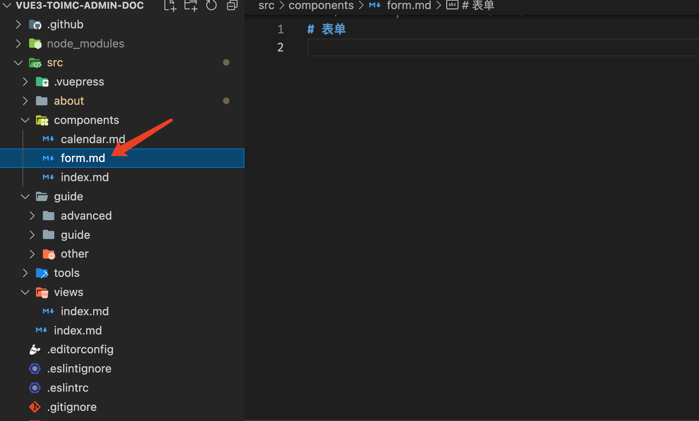

# 贡献指南

在参与贡献之前，请先熟读本规范。


## 必备的知识

- 必须要会使用MarkDown语法，并遵循 [编写规范](./standard)

- 学习vuepress的使用，参考[文档](https://v2.vuepress.vuejs.org/zh/)

- 需要了解 Github 的PR方式，并按照如下要求提交Commit，例如：

  ``` 
  格式: [todo] message
  
  todo: A - ADD, U - UPDATE, D - DELETE, F - FIX BUGS
  ```


## 贡献流程

- 下载仓库代码
  ```shell
  $ git clone https://github.com/toimc-team/vue3-toimc-admin-doc.git
  ```
  
- 本地安装
  ```shell
  $ pnpm install
  ```
  
- 使用终端进入项目目录并使用`pnpm run dev`运行项目，在浏览器中访问：`http://localhost:8080/vue-toimc-admin/`；

- 明确自己更新的文章或者内容的范畴。

  - 如果是组件或者hooks大的篇章，需要更新`config.js`中的目录；
  - 如果是小更新，只需要在先前别人的文章基础之上进行修订即可

- 新建`xxx.md`文章

  ::: warning

  如果是根目录，则需要创建一个index.md的文件

  :::

  系列文章的目录需要按照如下要求进行命名：

  

  说明：

  - 文章内，不要设置`sidebar: auto`

  - 文章内的一级标题与文件名同名，并去除标号，如：在组件中添加一个 form 的文档，首先在 `src/components/` 新建 `form.md` 文件，然后一级标题应该是 **表单**

    

  - 所有.md的文件的图片，存放在相对目录的`assets`目录中;

- 所有与组件相关的文档都写在 `/src/components/ `目录中，路由就应该在 `src/.vuepress/configs/sidebar.js` 文件的 `/components/` 配置项中  添加[查看示例](https://github.com/toimc-team/vue3-toimc-admin-doc/blob/main/src/.vuepress/configs/sidebar.js)

- 所有与hooks相关的文档都写在 `/src/hooks/` 目录中，路由就应该在 `src/.vuepress/configs/sidebar.js` 文件的 `/tools/` 配置项中添加  [查看示例](https://github.com/toimc-team/vue3-toimc-admin-doc/blob/main/src/.vuepress/configs/sidebar.js)

- 所有与views相关的文档都写在 `/src/views/`目录中，路由就应该在 `src/.vuepress/configs/sidebar.js` 文件的 `/views/` 配置项中添加 [查看示例](https://github.com/toimc-team/vue3-toimc-admin-doc/blob/main/src/.vuepress/configs/sidebar.js)

- 如果要添加某个系列的文档说明，就不应该是简单的 `{text: 'xx', '/xxx'}`，而应该是`{text: 'xx', children: ['xxx01', 'xxx02',..., 'xxxN']}`

- 文档结构及顺序

  - 简要介绍
  - 使用方法
  - 高级使用方法
  - API 属性的顺序
    - `Props`
    - `Events`
    - `Slots`
    - Props中对象属性的详细说明
  - API属性介绍，以表格形式，由以下几部分构成
    - 属性名
    - 类型
    - 默认值
    - 是否必传
    - 描述

- 按照 [编写规范](./standard)书写，一定注意不要有4级标题；

- 每完成一个部分进行一次commit；

- 完成一个大的功能介绍之后，提交一次PR；

- 管理员完成PR检查后，会自动合并，并部署发布出来。

