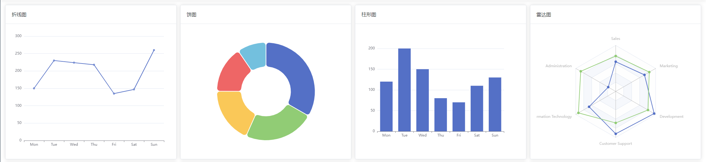

# echarts 图表

基于`vue-echarts`的封装。

## 效果



## 用法

```vue
<template>
  <div class="p-4 grid grid-cols-4 gap-3">
    <el-col>
      <t-card header="折线图">
        <v-charts type="LineChart" :option="lineOptions"></v-charts>
      </t-card>
    </el-col>
    <el-col>
      <t-card header="饼图">
        <v-charts type="PieChart" :option="pieOptions"></v-charts>
      </t-card>
    </el-col>
    <el-col>
      <t-card header="柱形图">
        <v-charts type="BarChart" :option="barOptions"></v-charts>
      </t-card>
    </el-col>
    <el-col>
      <t-card header="雷达图">
        <v-charts
          type="RadarChart"
          prefix-class="my-charts"
          :option="radarOptions"
        ></v-charts>
      </t-card>
    </el-col>
  </div>
</template>

<script lang="ts">
import { defineComponent } from 'vue'

export default defineComponent({
  setup() {
    // 折线图选项
    const lineOptions = ref<any>({
      grid: {
        top: 20,
        right: 20,
        bottom: 40,
        left: 40
      },
      xAxis: {
        type: 'category',
        data: ['Mon', 'Tue', 'Wed', 'Thu', 'Fri', 'Sat', 'Sun']
      },
      yAxis: {
        type: 'value'
      },
      series: {
        data: [150, 230, 224, 218, 135, 147, 260],
        type: 'line'
      }
    })

    // 饼图选项
    const pieOptions = ref<any>({
      grid: {
        top: 20,
        right: 20,
        bottom: 40,
        left: 40
      },
      tooltip: {
        trigger: 'item'
      },
      series: [
        {
          name: '访问来源',
          type: 'pie',
          radius: ['40%', '80%'],
          avoidLabelOverlap: false,
          itemStyle: {
            borderRadius: 10,
            borderColor: '#fff',
            borderWidth: 2
          },
          label: {
            show: false,
            position: 'center'
          },
          emphasis: {
            label: {
              show: true,
              fontSize: '14'
            }
          },
          labelLine: {
            show: false
          },
          data: [
            { value: 1048, name: '搜索引擎' },
            { value: 735, name: '直接访问' },
            { value: 580, name: '邮件营销' },
            { value: 484, name: '联盟广告' },
            { value: 300, name: '视频广告' }
          ]
        }
      ]
    })

    // 柱状图选项
    const barOptions = ref<any>({
      xAxis: {
        type: 'category',
        data: ['Mon', 'Tue', 'Wed', 'Thu', 'Fri', 'Sat', 'Sun']
      },
      yAxis: {
        type: 'value'
      },
      series: [
        {
          data: [120, 200, 150, 80, 70, 110, 130],
          type: 'bar'
        }
      ]
    })

    // 雷达图选项
    const radarOptions = ref<any>({
      radar: {
        indicator: [
          { name: 'Sales', max: 6500 },
          { name: 'Administration', max: 16000 },
          { name: 'Information Technology', max: 30000 },
          { name: 'Customer Support', max: 38000 },
          { name: 'Development', max: 52000 },
          { name: 'Marketing', max: 25000 }
        ]
      },
      series: [
        {
          name: 'Budget vs spending',
          type: 'radar',
          data: [
            {
              value: [4200, 3000, 20000, 35000, 50000, 18000],
              name: 'Allocated Budget'
            },
            {
              value: [5000, 14000, 28000, 26000, 42000, 21000],
              name: 'Actual Spending'
            }
          ]
        }
      ]
    })
    return { lineOptions, pieOptions, barOptions, radarOptions }
  }
})
</script>

<style scoped lang="scss">
.my-charts {
  width: 100%;
  height: 500px;
}
</style>
```

## 属性

| 属性        | 描述                                                        | 类型                                            | 可选值 | 默认值                                                                                      |
| ----------- | ----------------------------------------------------------- | ----------------------------------------------- | ------ | ------------------------------------------------------------------------------------------- |
| type        | 图表类型                                                    | [`ChartsType`](#chartstype)                     | -      | 'PieChart'                                                                                  |
| components  | 图表组件选项(提示浮层等)                                    | [`ChartsComponentsType`](#chartscomponentstype) | -      | ['TitleComponent', 'TooltipComponent', 'LegendComponent', 'AriaComponent', 'GridComponent'] |
| option      | ECharts 实例选项                                            | `Object`                                        | -      | {}                                                                                          |
| prefixClass | 类名前缀                                                    | `String丨Object`                                | -      | 'v-charts'                                                                                  |
| autoresize  | 指定 ECharts 实例在组件根元素尺寸变化时是否需要自动进行重绘 | `Boolean`                                       | -      | true                                                                                        |
| loading     | 指定图表的加载状态                                          | `Boolean`                                       | -      | true                                                                                        |

## 类型说明

### ChartsType

`ChartsType`是 echarts 图表类型，为以下字符串枚举的联合类型，可选值如下：

| 可选值               | 描述                                                                      |
| -------------------- | ------------------------------------------------------------------------- |
| 'BarChart'           | 柱状图                                                                    |
| 'BoxplotChart'       | 盒须图                                                                    |
| 'CandlestickChart'   | K 线图                                                                    |
| 'CustomChart'        | [自定义系列](https://echarts.apache.org/zh/option.html#series-custom)     |
| 'EffectScatterChart' | 特效散点图                                                                |
| 'FunnelChart'        | [漏斗图](https://echarts.apache.org/zh/option.html#series-funnel)         |
| 'GaugeChart'         | [仪表盘](https://echarts.apache.org/zh/option.html#series-gauge)          |
| 'GraphChart'         | [关系图](https://echarts.apache.org/zh/option.html#series-graph)          |
| 'HeatmapChart'       | 热力图                                                                    |
| 'LineChart'          | 折线图                                                                    |
| 'LinesChart'         | [折线/面积图](https://echarts.apache.org/zh/option.html#series-line)      |
| 'MapChart'           | 地图                                                                      |
| 'ParallelChart'      | [平行坐标系](https://echarts.apache.org/zh/option.html#parallel)          |
| 'PictorialBarChart'  | [象柱形图](https://echarts.apache.org/zh/option.html#series-pictorialBar) |
| 'PieChart'           | 饼图                                                                      |
| 'RadarChart'         | 雷达图                                                                    |
| 'SankeyChart'        | 桑基图                                                                    |
| 'ScatterChart'       | 散点图                                                                    |
| 'SunburstChart'      | 旭日图                                                                    |
| 'ThemeRiverChart'    | [主题河流图](https://echarts.apache.org/zh/option.html#series-themeRiver) |
| 'TreeChart'          | [树图](https://echarts.apache.org/zh/option.html#series-tree)             |
| 'TreemapChart'       | [树映射图](https://echarts.apache.org/zh/option.html#series-treemap)      |

### ChartsComponentsType

`ChartsComponentsType`是 echarts 图表的组件类型，为以下字符串枚举的联合类型，可选值如下：

| 可选值                         | 描述                                                                                  |
| ------------------------------ | ------------------------------------------------------------------------------------- |
| 'AriaComponent'                | [无障碍设置](https://echarts.apache.org/zh/option.html#aria)                          |
| 'AxisPointerComponent'         | 坐标轴组件                                                                            |
| 'BrushComponent'               | [区域选择组件](https://echarts.apache.org/zh/option.html#brush)                       |
| 'CalendarComponent'            | [日历坐标系组件](https://echarts.apache.org/zh/option.html#calendar)                  |
| 'DataZoomComponent'            | [区域缩放组件](https://echarts.apache.org/zh/option.html#dataZoom)                    |
| 'DataZoomInsideComponent'      | [内置型数据区域缩放组件](https://echarts.apache.org/zh/option.html#dataZoom-inside)   |
| 'DataZoomSliderComponent'      | [滑动条型数据区域缩放组件](https://echarts.apache.org/zh/option.html#dataZoom-slider) |
| 'DatasetComponent'             | 数据集                                                                                |
| 'GeoComponent'                 | 地理坐标系组件                                                                        |
| 'GraphicComponent'             | [原生图形元素组件](https://echarts.apache.org/zh/option.html#graphic)                 |
| 'GridComponent'                | 直角坐标系组件                                                                        |
| 'GridSimpleComponent'          | -                                                                                     |
| 'LegendComponent'              | 图例组件                                                                              |
| 'LegendPlainComponent'         | 普通图例组件                                                                          |
| 'LegendScrollComponent'        | 滚动翻页图例组件                                                                      |
| 'MarkAreaComponent'            | -                                                                                     |
| 'MarkLineComponent'            | -                                                                                     |
| 'MarkPointComponent'           | -                                                                                     |
| 'ParallelComponent'            | 平行坐标系组件                                                                        |
| 'PolarComponent'               | 极坐标系组件                                                                          |
| 'RadarComponent'               | 雷达图坐标系组件                                                                      |
| 'SingleAxisComponent'          | [单轴组件](https://echarts.apache.org/zh/option.html#singleAxis)                      |
| 'TimelineComponent'            | [时间线组件](https://echarts.apache.org/zh/option.html#timeline)                      |
| 'TitleComponent'               | 标题组件                                                                              |
| 'ToolboxComponent'             | [工具栏组件](https://echarts.apache.org/zh/option.html#toolbox)                       |
| 'TooltipComponent'             | 浮层提示框组件                                                                        |
| 'TransformComponent'           | 内置数据转换器组件                                                                    |
| 'VisualMapComponent'           | [视觉映射组件](https://echarts.apache.org/zh/option.html#visualMap)                   |
| 'VisualMapContinuousComponent' | [连续型视觉映射组件](https://echarts.apache.org/zh/option.html#visualMap-continuous)  |
| 'VisualMapPiecewiseComponent'  | [分段型视觉映射组件](https://echarts.apache.org/zh/option.html#visualMap-piecewise)() |
