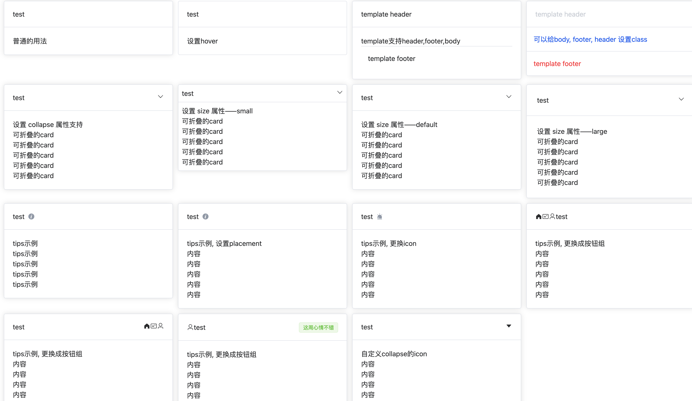

# 卡片

基于 `el-card` 二次封装的卡片组件 

## 效果



## 用法

```typescript
<template>
  <div class="p-4 grid grid-cols-4 gap-3">
    <t-card header="test">普通的用法</t-card>
    <t-card shadow="hover" header="test">设置hover</t-card>
    <t-card>
      <template #header>template header</template>
      <template #footer>template footer</template>
      <div>template支持header,footer,body</div>
    </t-card>
    <t-card body-class="p-4 text-blue-600" footer-class="text-red-500" header-class="text-gray-300">
      <template #header>template header</template>
      <template #footer>template footer</template>
      可以给body, footer, header 设置class
    </t-card>
    <t-card header="test" collapse>
      <p>设置 collapse 属性支持</p>
      <p>可折叠的card</p>
      <p>可折叠的card</p>
      <p>可折叠的card</p>
      <p>可折叠的card</p>
      <p>可折叠的card</p>
    </t-card>
    <t-card header="test" size="small" collapse>
      <p>设置 size 属性——small</p>
      <p>可折叠的card</p>
      <p>可折叠的card</p>
      <p>可折叠的card</p>
      <p>可折叠的card</p>
      <p>可折叠的card</p>
    </t-card>
    <t-card header="test" collapse>
      <p>设置 size 属性——default</p>
      <p>可折叠的card</p>
      <p>可折叠的card</p>
      <p>可折叠的card</p>
      <p>可折叠的card</p>
      <p>可折叠的card</p>
    </t-card>
    <t-card header="test" size="large" collapse>
      <p>设置 size 属性——large</p>
      <p>可折叠的card</p>
      <p>可折叠的card</p>
      <p>可折叠的card</p>
      <p>可折叠的card</p>
      <p>可折叠的card</p>
    </t-card>
    <t-card header="test" tips="这里是tips">
      <p>tips示例</p>
      <p>tips示例</p>
      <p>tips示例</p>
      <p>tips示例</p>
      <p>tips示例</p>
    </t-card>
    <t-card header="test" :tips="{ content: '这里是tips', placement: 'top' }">
      <p>tips示例, 设置placement</p>
      <p>内容</p>
      <p>内容</p>
      <p>内容</p>
      <p>内容</p>
      <p>内容</p>
    </t-card>
    <t-card
      header="test"
      :tips="{ content: '这里是tips', placement: 'top' }"
      tips-icon="ant-design:alert-filled"
    >
      <p>tips示例, 更换icon</p>
      <p>内容</p>
      <p>内容</p>
      <p>内容</p>
      <p>内容</p>
      <p>内容</p>
    </t-card>
    <t-card header="test" reverse :tips="true">
      <template #tips>
        <icon icon="ep:home-filled"></icon>
        <icon icon="ep:postcard"></icon>
        <icon icon="ep:user"></icon>
      </template>
      <p>tips示例, 更换成按钮组</p>
      <p>内容</p>
      <p>内容</p>
      <p>内容</p>
      <p>内容</p>
      <p>内容</p>
    </t-card>
    <t-card header="test" reverse :tips="true">
      <template #suffix>
        <icon icon="ep:home-filled"></icon>
        <icon icon="ep:postcard"></icon>
        <icon icon="ep:user"></icon>
      </template>
      <p>tips示例, 更换成按钮组</p>
      <p>内容</p>
      <p>内容</p>
      <p>内容</p>
      <p>内容</p>
      <p>内容</p>
    </t-card>
    <t-card header="test" reverse :tips="true">
      <template #tips>
        <icon icon="ep:user"></icon>
      </template>
      <template #suffix>
        <el-tag type="success">这周心情不错</el-tag>
      </template>
      <p>tips示例, 更换成按钮组</p>
      <p>内容</p>
      <p>内容</p>
      <p>内容</p>
      <p>内容</p>
      <p>内容</p>
    </t-card>
    <t-card header="test" :tips="true" collapse>
      <template #collapse="{ show }">
        <icon v-show="show" icon="ant-design:caret-down-outlined"></icon>
        <icon v-show="!show" icon="ant-design:caret-up-filled"></icon>
      </template>
      <p>自定义collapse的icon</p>
      <p>内容</p>
      <p>内容</p>
      <p>内容</p>
      <p>内容</p>
      <p>内容</p>
    </t-card>
  </div>
</template>
```

## 属性

全部属性

``` typescript
// 卡片标题
header: {
  type: String,
  default: ''
},
// body的样式
bodyStyle: {
  type: Object as PropType<CSSProperties>,
  default: () => ({})
},
headerClass: {
  type: String,
  default: ''
},
bodyClass: {
  type: String,
  default: ''
},
footerClass: {
  type: String,
  default: ''
},
// 是否折叠
collapse: {
  type: Boolean,
  default: false
},
// 设置阴影显示时机
shadow: {
  type: String as PropType<'always' | 'hover' | 'never'>,
  default: 'always'
},
// 大小
size: {
  type: String as PropType<'small' | 'default' | 'large'>,
  default: 'default'
},
// 提示文本
tips: {
  type: [String, Boolean, Object] as PropType<string | boolean | ToolTipsType>,
  default: ''
},
// 布局
layout: {
  type: String as PropType<CardLayoutType>,
  default: 'default'
},
// 提示图标
tipsIcon: {
  type: String,
  default: 'ep:info-filled'
},
// title与tips调换位置
reverse: {
  type: Boolean,
  default: false
}

```