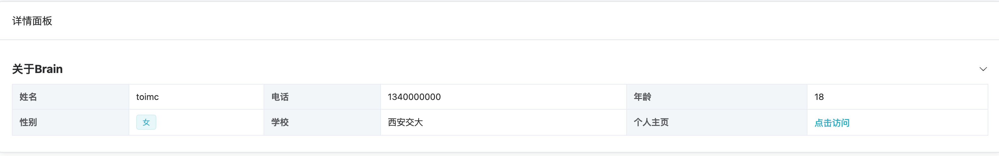

# 详情面板

基于`el-descriptions`二次封装 `descriptions`详情面板组件，可根据自己的业务进行扩展使用。

## 效果




## 用法

```typescript
<template>
  <div class="p-4">
    <el-card header="详情面板">
      <descriptions title="关于Brain" :items="items"></descriptions>
    </el-card>
  </div>
</template>

<script lang="ts">
  import { DescItem } from '@/components/Descriptions/types'
  import { defineComponent } from 'vue'

  export default defineComponent({
    setup() {
      const items = ref([
        {
          label: '姓名',
          field: 'toimc'
        },
        {
          label: '电话',
          field: '1340000000'
        },
        {
          label: '年龄',
          field: '18'
        },
        {
          label: '性别',
          field: '女',
          tag: {
            type: 'primary'
          }
        },
        {
          label: '学校',
          field: '西安交大'
        },
        {
          label: '个人主页',
          field: {
            link: 'https://www.toimc.com',
            text: '点击访问'
          }
        }
      ] as DescItem[])
      return {
        items
      }
    }
  })
</script>
```

## 属性

| 属性       | 描述             | 类型    | 可选值 | 默认值 |
| :--------- | :--------------- | :------ | :----- | :----- |
| direction      |   展示布局     | string  | vertical｜horizontal    |  horizontal      |
| size | 大小   | string  | large｜default｜ small    | default       |
| title    | 详情面板标题 | string | —      | —   |
| extra    |  | string | —      |  — |
| border    | 是否展示边框 | boolean | —        | true  |
| collapse    | 是否折叠 | boolean |  — | true  |
| items    | 详情内容 | array | —      | —    |
| column    | 列的数量 | number | —      | 3  |