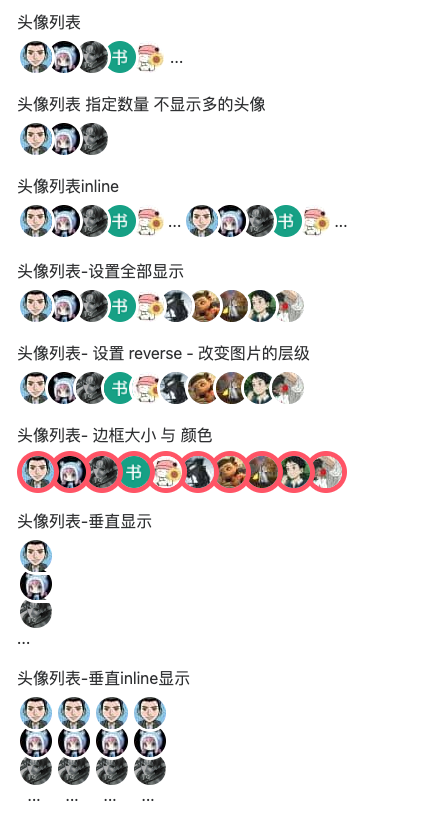

# 头像列表

`avatar-list`展示一系列用户列表，常在评论列表、关联用户等地方使用。


## 效果



## 属性

可以传递图片为`string`或者`ImageType`：

```typescript
interface ImagesType {
  src: string
  [key: string]: any
}
```

全部属性：

```ts
// 数据源
images: {
  type: Array as PropType<string[] | ImagesType[]>,
  default: () => []
},
// 最多显示5个
num: {
  type: Number,
  default: 5
},
// 头像大小
size: {
  type: Number,
  default: 32
},
direction: {
  type: String as PropType<'vertical' | 'horizontal'>,
  default: 'horizontal'
},
// 叠加的偏移量，默认是margin-left: 0
gutter: {
  type: Number,
  default: 0
},
// 边框颜色
borderColor: {
  type: String,
  default: 'white'
},
// 边框宽度
borderWidth: {
  type: String,
  default: '3px'
},
showMore: {
  type: Boolean,
  default: true
},
// 显示层级
reverse: {
  type: Boolean,
  default: true
},
// 是否是行内显示
inline: {
  type: Boolean,
  default: false
}
```


## 事件

```ts
const handleClick = (item: string | ImageType, index: number) => {
  emit('click', { item, index })
}
```

可以添加单个头像的`click`事件，返回头像的item与index。


## 用法

演示数据源为`string[]`。


### 普通

```vue
<avatar-list :images="images" :gutter="10" direction="horizontal"></avatar-list>
```


### 设置最多显示

```vue
<avatar-list
  :images="images"
  :num="3"
  :gutter="10"
  direction="horizontal"
  :show-more="false"
></avatar-list>
```


### inline

```vue
<avatar-list :images="images" :gutter="10" direction="horizontal" inline></avatar-list>
<avatar-list :images="images" :gutter="10" direction="horizontal" inline></avatar-list>
```


### 全部显示

```vue
<avatar-list :images="images" :gutter="10" :num="0" direction="horizontal"></avatar-list>
```


### reverse层级

::: tip

这里的`num`为`0`，是显示所有的头像列表。

:::

添加`reverse`属性：

```vue
<avatar-list
  :images="images"
  :gutter="10"
  :num="0"
  direction="horizontal"
  :reverse="false"
></avatar-list>
```


### 设置边框大小与颜色

::: tip

这里的`num`为`0`，是显示所有的头像列表。

:::

```vue
<avatar-list
  :images="images"
  :gutter="10"
  :num="0"
  direction="horizontal"
  :border-color="'#f56'"
  :border-width="'5px'"
></avatar-list>
```


### 垂直显示

```vue
<avatar-list :images="images" :gutter="10" :num="3" direction="vertical"></avatar-list>
```

