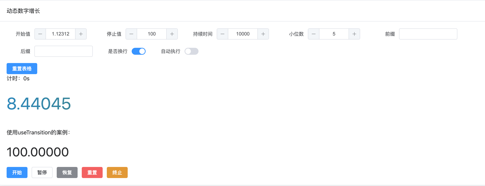

# 动态数字

数字动画组件



## 基础案例用法

``` typescript
<template>
  <div class="p-4">
    <el-card header="动态数字增长">
      <el-row>
        <basic-form :schemas="formSchema" inline label-width="80px" @change="handleChange">
          <template #action="{ form: formRef }">
            <el-row>
              <el-button type="primary" @click="() => handleFormReset(formRef)">重置表格</el-button>
            </el-row>
          </template>
        </basic-form>
        <div>计时：{{ counter }}s</div>
      </el-row>
      <div class="text-center py-6 break-words">
        <d-numbers
          ref="ctrl"
          :end="form.end"
          :begin="form.begin"
          :dot="form.dot"
          :duration="form.duration"
          :auto="form.auto"
          :size="48"
          :break-all="form.breakAll"
          :classes="'d-text'"
          split=","
        >
          <template #prefix>{{ form.prefix }}</template>
          <template #suffix>{{ form.suffix }}</template>
        </d-numbers>
      </div>
      <el-row>
        <el-button type="primary" @click="handleStart">开始</el-button>
        <el-button @click="handlePause">暂停</el-button>
        <el-button type="info" @click="handleResume">恢复</el-button>
        <el-button type="danger" @click="handleReset">重置</el-button>
        <el-button type="warning" @click="handleTerminate">终止</el-button>
      </el-row>
    </el-card>
  </div>
</template>

<script lang="ts">
  import { FormSchema } from '@/components/Form/types/types'
  import { defineComponent } from 'vue'

  export default defineComponent({
    setup() {
      const ctrl = ref()
      const ctrl1 = ref()
      const counter = ref(0)

      let form = reactive({
        begin: 1.12312,
        end: 100,
        duration: 10000,
        dot: 5,
        auto: false,
        breakAll: true,
        prefix: '',
        suffix: ''
      })

      const { pause, resume } = useIntervalFn(
        () => {
          /* your function */
          counter.value += 1
          if (counter.value >= form.duration / 1000) {
            pause()
          }
        },
        1000,
        { immediate: false }
      )

      const formSchema: FormSchema[] = reactive([
        {
          component: 'input-number',
          value: form.begin,
          label: '开始值',
          prop: 'begin'
        },
        {
          component: 'input-number',
          value: form.end,
          label: '停止值',
          prop: 'end'
        },
        {
          component: 'input-number',
          value: form.duration,
          label: '持续时间',
          prop: 'duration',
          attrs: {
            step: 1000
          }
        },
        {
          component: 'input-number',
          value: form.dot,
          label: '小位数',
          prop: 'dot'
        },
        {
          component: 'input',
          value: form.prefix,
          label: '前缀',
          prop: 'prefix'
        },
        {
          component: 'input',
          value: form.suffix,
          label: '后缀',
          prop: 'suffix'
        },
        {
          component: 'switch',
          value: form.breakAll,
          label: '是否换行',
          prop: 'breakAll'
        },
        {
          component: 'switch',
          value: form.auto,
          label: '自动执行',
          prop: 'auto'
        }
      ] as FormSchema[])

      function handleStart() {
        counter.value = 0
        resume()
        ctrl.value?.start()
        // count-to案例
        ctrl1.value?.start()
      }

      function handlePause() {
        pause()
        ctrl.value?.pause()
      }

      function handleResume() {
        resume()
        ctrl.value?.resume()
      }

      function handleReset() {
        counter.value = 0
        pause()
        ctrl.value?.reset()
        // count-to案例
        ctrl1.value?.reset()
      }

      function handleTerminate() {
        pause()
        counter.value = 0
        ctrl.value?.terminate()
      }

      async function handleFormReset(form) {
        form?.resetFields()
        await nextTick()
        handleReset()
      }

      async function handleChange(val) {
        form.dot = val.dot
        form.prefix = val.prefix
        form.suffix = val.suffix
        form.duration = val.duration
        form.begin = val.begin
        form.end = val.end
        form.auto = val.auto
        form.breakAll = val.breakAll
        handleReset()
        await nextTick()
        form.auto && handleStart()
      }

      return {
        ctrl,
        ctrl1,
        formSchema,
        form,
        handleStart,
        handlePause,
        handleResume,
        handleReset,
        handleTerminate,
        handleChange,
        handleFormReset,
        counter
      }
    }
  })
</script>

<style scoped lang="scss">
  :deep(.d-text) {
    background: linear-gradient(90deg, #3493c3, #688c3c, #df6b27);
    background-clip: text;
    -webkit-text-fill-color: transparent;
  }
</style>

```


### 属性

| 属性       | 描述             | 类型    | 可选值 | 默认值 |
| :--------- | :--------------- | :------ | :----- | :----- |
| begin      | 开始值       | number｜string  | —      |  0      |
| end | 停止值   | number｜string  | 必传    |   0     |
| duration    | 动画持续时间 | number | —      | false  |
| setupDuration    | 设置持续时间 | number | —      | 10  |
| dot    | 保留小数点位数  | number | —      | 0  |
| classes    | 类名 | string | —      | d-numbers  |
| auto    | 自动执行 | boolean | —      | true  |
| breakAll    | 是否换行 | boolean | —      | false  |
| size    | 字体大小 | number|string | —      | 16px  |
| style    | 样式 | object | —      | —  |
| split    | 分隔符 | string | —      | — |
| format    | 格式化 | function | —      | null  |


### 插槽


| 名称 | 说明                                               |
| :----- | :------------------------------------------------- | 
| prefix | 前缀 | 
| suffix  | 后缀 |


## useTransition案例用法

``` typescript
<template>
  <div class="p-4">
    <el-card header="动态数字增长">
      <el-row>
        <basic-form :schemas="formSchema" inline label-width="80px" @change="handleChange">
          <template #action="{ form: formRef }">
            <el-row>
              <el-button type="primary" @click="() => handleFormReset(formRef)">重置表格</el-button>
            </el-row>
          </template>
        </basic-form>
        <div>计时：{{ counter }}s</div>
      </el-row>
      <p class="pt-3">使用useTransition的案例：</p>
      <div class="text-left py-6 text-4xl">
        <count-to
          ref="ctrl1"
          :end-val="form.end"
          :start-val="form.begin"
          :decimals="form.dot"
          :duration="form.duration"
          :autoplay="form.auto"
          :classes="'d-text'"
          separator=","
          :prefix="form.prefix"
          :suffix="form.suffix"
        >
        </count-to>
      </div>
      <el-row>
        <el-button type="primary" @click="handleStart">开始</el-button>
        <el-button @click="handlePause">暂停</el-button>
        <el-button type="info" @click="handleResume">恢复</el-button>
        <el-button type="danger" @click="handleReset">重置</el-button>
        <el-button type="warning" @click="handleTerminate">终止</el-button>
      </el-row>
    </el-card>
  </div>
</template>

<script lang="ts">
  import { FormSchema } from '@/components/Form/types/types'
  import { defineComponent } from 'vue'

  export default defineComponent({
    setup() {
      const ctrl = ref()
      const ctrl1 = ref()
      const counter = ref(0)

      let form = reactive({
        begin: 1.12312,
        end: 100,
        duration: 10000,
        dot: 5,
        auto: false,
        breakAll: true,
        prefix: '',
        suffix: ''
      })

      const { pause, resume } = useIntervalFn(
        () => {
          /* your function */
          counter.value += 1
          if (counter.value >= form.duration / 1000) {
            pause()
          }
        },
        1000,
        { immediate: false }
      )

      const formSchema: FormSchema[] = reactive([
        {
          component: 'input-number',
          value: form.begin,
          label: '开始值',
          prop: 'begin'
        },
        {
          component: 'input-number',
          value: form.end,
          label: '停止值',
          prop: 'end'
        },
        {
          component: 'input-number',
          value: form.duration,
          label: '持续时间',
          prop: 'duration',
          attrs: {
            step: 1000
          }
        },
        {
          component: 'input-number',
          value: form.dot,
          label: '小位数',
          prop: 'dot'
        },
        {
          component: 'input',
          value: form.prefix,
          label: '前缀',
          prop: 'prefix'
        },
        {
          component: 'input',
          value: form.suffix,
          label: '后缀',
          prop: 'suffix'
        },
        {
          component: 'switch',
          value: form.breakAll,
          label: '是否换行',
          prop: 'breakAll'
        },
        {
          component: 'switch',
          value: form.auto,
          label: '自动执行',
          prop: 'auto'
        }
      ] as FormSchema[])

      function handleStart() {
        counter.value = 0
        resume()
        ctrl.value?.start()
        // count-to案例
        ctrl1.value?.start()
      }

      function handlePause() {
        pause()
        ctrl.value?.pause()
      }

      function handleResume() {
        resume()
        ctrl.value?.resume()
      }

      function handleReset() {
        counter.value = 0
        pause()
        ctrl.value?.reset()
        // count-to案例
        ctrl1.value?.reset()
      }

      function handleTerminate() {
        pause()
        counter.value = 0
        ctrl.value?.terminate()
      }

      async function handleFormReset(form) {
        form?.resetFields()
        await nextTick()
        handleReset()
      }

      async function handleChange(val) {
        form.dot = val.dot
        form.prefix = val.prefix
        form.suffix = val.suffix
        form.duration = val.duration
        form.begin = val.begin
        form.end = val.end
        form.auto = val.auto
        form.breakAll = val.breakAll
        handleReset()
        await nextTick()
        form.auto && handleStart()
      }

      return {
        ctrl,
        ctrl1,
        formSchema,
        form,
        handleStart,
        handlePause,
        handleResume,
        handleReset,
        handleTerminate,
        handleChange,
        handleFormReset,
        counter
      }
    }
  })
</script>

<style scoped lang="scss">
  :deep(.d-text) {
    background: linear-gradient(90deg, #3493c3, #688c3c, #df6b27);
    background-clip: text;
    -webkit-text-fill-color: transparent;
  }
</style>

```


### 属性

| 属性       | 描述             | 类型    | 可选值 | 默认值 |
| :--------- | :--------------- | :------ | :----- | :----- |
| startVal      | 起始值       | number | —      |  0      |
| endVal | 结束值   | number  |  —   |   2021    |
| duration    | 动画持续时间 | number | —      | 1500  |
| autoplay    | 自动执行 | boolean | —      | true  |
| decimals    |保留小数点位数  | number | —      | 0  |
| prefix    | 前缀 | string | —      |  —  |
| suffix    | 后缀 | string | —      | —  |
| separator    | 分隔符 | string | —      | ,  |
| decimal    | 小数点分隔符 | string | —      | . |
| color    | 字体颜色 | string | —      | —  |
| useEasing    | 是否开启动画 | boolean | —      | true |
| transition    | 动画效果 | string | —      | linear  |


### 事件


| 事件名 | 说明                                               | 参数            |
| :----- | :------------------------------------------------- | :-------------- |
| onStarted | 开始执行动画 | ()=>void |
| onFinished  | 停止执行动画 | ()=>void |