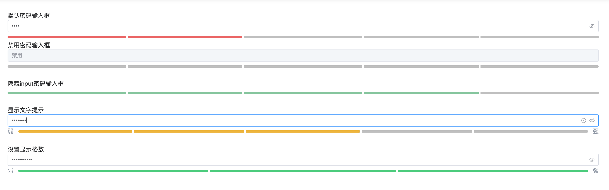

# 密码强度

进阶更多密码强度组件用法



## 基础用法

```typescript
<template>
  <div class="demo-wrap p-4">
    <div class="p-4 wrap">
      <h1>默认密码输入框</h1>
      <strength-meter placeholder="默认" />
      <h1>禁用密码输入框</h1>
      <strength-meter placeholder="禁用" disabled />
      <br />
      <h1>隐藏input密码输入框</h1>
      <strength-meter placeholder="隐藏input" :show-input="false" value="!@#qwe12345" />
      <br />
      <h1>显示文字提示</h1>
      <strength-meter placeholder="隐藏input" show-text value="!@#qwe12345" />
      <br />
      <h1>设置显示格数</h1>
      <strength-meter placeholder="隐藏input" show-text value="!@#qwe12345" :number="3" />
    </div>
  </div>
</template>
```


## 属性

| 属性       | 描述             | 类型    | 可选值 | 默认值 |
| :--------- | :--------------- | :------ | :----- | :----- |
| value      | 密码Input框的value值       | string  | —      |    —     |
| showInput | 是否显示Input密码输入框   | boolean  | —      |   true     |
| number    | 设置显示格数 | number | 3｜5     | 5  |
| disabled    | 是否禁用密码输入框 | boolean | —      | false  |
| placeholder    | Input的placeholder值 | string | —      |  —  |
| showText    | 是否显示文字提示 | boolean | —      | false  |


## 事件


| 事件名 | 说明                                               | 参数            |
| :----- | :------------------------------------------------- | :-------------- |
| score-change | 数据改变时触发 | val，改变后的值 |
| change  | 值改变时触发 | val，新状态的值 |