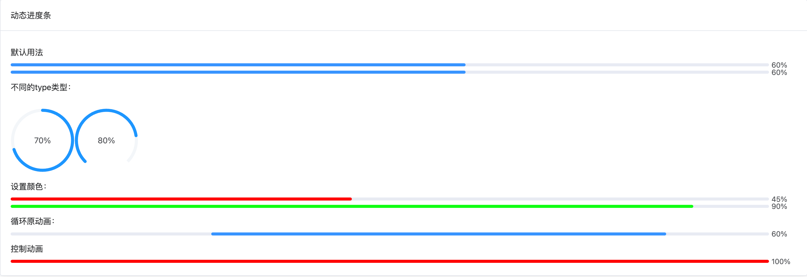

# 动态进度条

二次封装`element-plus`进度条组件，进阶更多功能


## 效果


## 基础用法

```typescript
<template>
  <div class="p-4">
    <el-card header="动态进度条">
      <p>默认用法</p>
      <d-progress is-animation :percentage="60" :time="1500"></d-progress>
      <d-progress is-animation :percentage="60"></d-progress>
      <p>不同的type类型：</p>
      <br />
      <d-progress is-animation :percentage="70" type="circle"></d-progress>
      <d-progress is-animation :percentage="80" type="dashboard"></d-progress>
      <p>设置颜色：</p>
      <d-progress is-animation :percentage="45" color="red"></d-progress>
      <d-progress is-animation :percentage="90" color="#10FD12"></d-progress>
      <p>循环原动画：</p>
      <d-progress indeterminate :percentage="60"></d-progress>
      <p>控制动画</p>
      <d-progress is-animation :percentage="100" color="red"></d-progress>
    </el-card>
  </div>
</template>
```


## 属性

| 属性       | 描述             | 类型    | 可选值 | 默认值 |
| :--------- | :--------------- | :------ | :----- | :----- |
| percentage      | 百分比       | number  | —      |    0    |
| isAnimation | 是否开启动画   | boolean  | —      |   false     |
| time    | 控制动画进度条速度 | number | —      | 3000  |
| ease    | 动画类型 | string | —      | power1.out  |

[其他属性可参考element-plus官网](https://element-plus.org/zh-CN/component/progress.html#progress-%E5%B1%9E%E6%80%A7)
