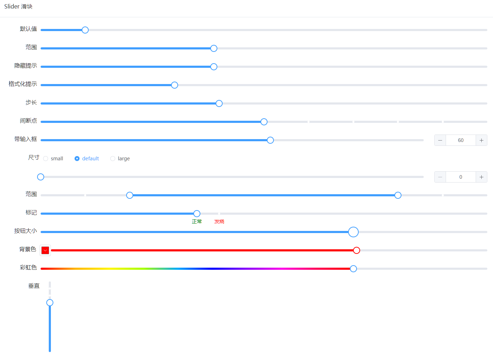

# 滑块

滑块组件基于 `element-plus` 中的 `slider` 扩展封装而成，在原来的基础上新增以下功能：

- 颜色配置，您可以直接使用属性来设置滑块的背景颜色
- 尺寸配置，你可以自定义滑块按钮的尺寸
- 还可以通过一个属性将滑块的背景显示为彩虹色

## 属性

扩展新增属性说明如下：

| 属性       | 描述             | 类型    | 可选值 | 默认值 |
| :--------- | :--------------- | :------ | :----- | :----- |
| color      | 滑块的颜色       | string  | —      |        |
| buttonSize | 滑块按钮的尺寸   | number  | —      |        |
| rainbow    | 是否显示为彩虹色 | boolean | —      | false  |

原生属性说明如下:

| 属性                  | 描述                                                         | 类型            | 可选值                  | 默认值  |
| :-------------------- | :----------------------------------------------------------- | :-------------- | :---------------------- | :------ |
| model-value / v-model | 选中项绑定值                                                 | number          | —                       | 0       |
| min                   | 最小值                                                       | number          | —                       | 0       |
| max                   | 最大值                                                       | number          | —                       | 100     |
| disabled              | 是否禁用                                                     | boolean         | —                       | false   |
| step                  | 步长                                                         | number          | —                       | 1       |
| show-input            | 是否显示输入框，仅在非范围选择时有效                         | boolean         | —                       | false   |
| show-input-controls   | 在显示输入框的情况下，是否显示输入框的控制按钮               | boolean         | —                       | true    |
| size                  | 滑块的大小                                                   | string          | large / default / small | default |
| input-size            | 输入框的大小，如果设置了 `size` 属性，默认值自动取 `size`    | string          | large / default / small | default |
| show-stops            | 是否显示间断点                                               | boolean         | —                       | false   |
| show-tooltip          | 是否显示提示信息                                             | boolean         | —                       | true    |
| format-tooltip        | 格式化提示信息                                               | function(value) | —                       | —       |
| range                 | 是否开启选择范围                                             | boolean         | —                       | false   |
| vertical              | 垂直模式                                                     | boolean         | —                       | false   |
| height                | 滑块高度，垂直模式必填                                       | string          | —                       | —       |
| label                 | 屏幕阅读器标签                                               | string          | —                       | —       |
| range-start-label     | 当 `range` 为true时，屏幕阅读器标签开始的标记                | string          | —                       | —       |
| range-end-label       | 当 `range` 为true时，屏幕阅读器标签结尾的标记                | string          | —                       | —       |
| format-value-text     | 显示屏幕阅读器的 `aria-valuenow` 属性的格式                  | function(value) | —                       | —       |
| debounce              | 输入时的去抖延迟，毫秒，仅在 `show-input` 等于 true 时有效   | number          | —                       | 300     |
| tooltip-class         | tooltip 的自定义类名                                         | string          | —                       | —       |
| marks                 | 标记， key 的类型必须为 `number` 且取值在闭区间 `[min, max]` 内，每个标记可以单独设置样式 | object          | —                       | —       |

你可以参考原生 [slider](https://element-plus.gitee.io/zh-CN/component/slider.html#%E5%B1%9E%E6%80%A7) 组件的属性文档。

## 事件

仍提供原 slider 支持的事件，说明如下：

| 事件名 | 说明                                               | 参数            |
| :----- | :------------------------------------------------- | :-------------- |
| change | 值改变时触发（使用鼠标拖曳时，只在松开鼠标后触发） | val，新状态的值 |
| input  | 数据改变时触发（使用鼠标拖曳时，活动过程实时触发） | val，改变后的值 |

