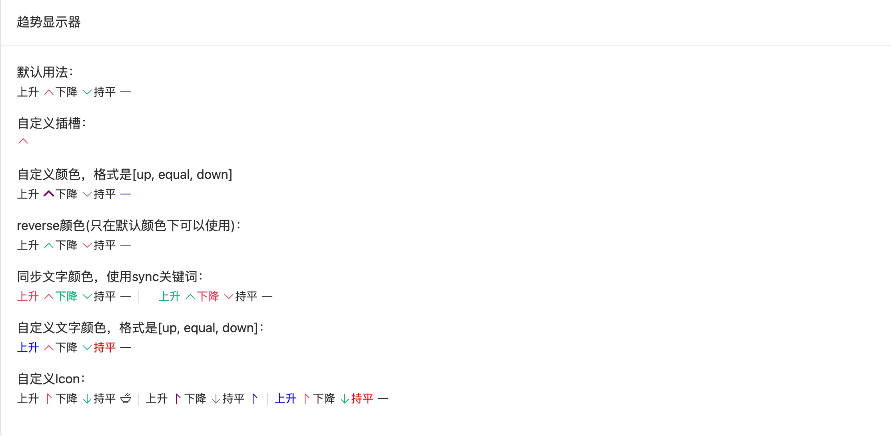

# 趋势显示器



## 基础用法

```typescript
<template>
  <div class="p-4">
    <el-card header="趋势显示器">
      <div class="pb-4">
        <div>默认用法：</div>
        <trend type="up" text="上升"></trend>
        <trend type="down" text="下降"></trend>
        <trend type="equal" text="持平"></trend>
      </div>
      <div class="pb-4">
        <div>自定义插槽：</div>
        <trend type="up">自定义插槽</trend>
      </div>
      <div class="pb-4">
        <div>自定义颜色，格式是[up, equal, down]</div>
        <trend type="up" text="上升" bold :colors="['purple', 'gray', 'blue']"></trend>
        <trend type="down" text="下降" :colors="['', '', 'gray']"></trend>
        <trend type="equal" text="持平" :colors="['', 'blue', '']"></trend>
      </div>
      <div class="pb-4">
        <div>reverse颜色(只在默认颜色下可以使用)：</div>
        <trend type="up" text="上升" reverse></trend>
        <trend type="down" text="下降" reverse></trend>
        <trend type="equal" text="持平" reverse></trend>
      </div>
      <div class="pb-4">
        <div>同步文字颜色，使用sync关键词：</div>
        <trend type="up" text="上升" sync></trend>
        <trend type="down" text="下降" sync></trend>
        <trend type="equal" text="持平" sync></trend>
        <el-divider direction="vertical" class="px-2"></el-divider>
        <trend type="up" text="上升" reverse sync></trend>
        <trend type="down" text="下降" reverse sync></trend>
        <trend type="equal" text="持平" reverse sync></trend>
      </div>
      <div class="pb-4">
        <div>自定义文字颜色，格式是[up, equal, down]：</div>
        <trend type="up" text="上升" :text-colors="['blue']"></trend>
        <trend type="down" text="下降" :text-colors="['', '', '#333']"></trend>
        <trend type="equal" text="持平" :text-colors="['', 'red', '']"></trend>
      </div>
      <div class="pb-4">
        <div>自定义Icon：</div>
        <trend type="up" text="上升" icon="SortUp"></trend>
        <trend type="down" text="下降" icon="Bottom"></trend>
        <trend type="equal" text="持平" icon="Bowl"></trend>
        <el-divider direction="vertical"></el-divider>
        <trend type="up" text="上升" icon="SortUp" :colors="['purple', 'gray', 'blue']"></trend>
        <trend type="down" text="下降" icon="Bottom" :colors="['', '', 'gray']"></trend>
        <trend type="equal" text="持平" icon="SortUp" :colors="['', 'blue', '']"></trend>
        <el-divider direction="vertical"></el-divider>
        <trend type="up" text="上升" :text-colors="['blue']" icon="SortUp"></trend>
        <trend type="down" text="下降" :text-colors="['', '', '#333']" icon="Bottom"></trend>
        <trend type="equal" text="持平" :text-colors="['', 'red', '']"></trend>
      </div>
    </el-card>
  </div>
</template>
```

## 属性

| 属性       | 描述             | 类型    | 可选值 | 默认值 |
| :--------- | :--------------- | :------ | :----- | :----- |
| wrapper      |        | string  | —      |    div    |
| cls |    | string  | —      |    —     |
| type    | 类型 | string | up｜down ｜ equal   | equal  |
| text    | 显示器文本 | string | —      | —   |
| bold    | 是否加粗 | boolean | —      | false  |
| reverse    | 是否倒序 | boolean | —      | false  |
| colors    | 自定义图标颜色 | array | —      | '#f43f5e', '#333', '#10b981'  |
| sync    | 是否使用关键词 | boolean | —      | false  |
| textColors    | 自定义文字颜色 | array | —      |   —  |
| icon    | 显示器图标 | string | —      |  —  |

## 插槽

| 名称 | 说明                                               |
| :----- | :------------------------------------------------- | 
| — | 自定义插槽 | 
