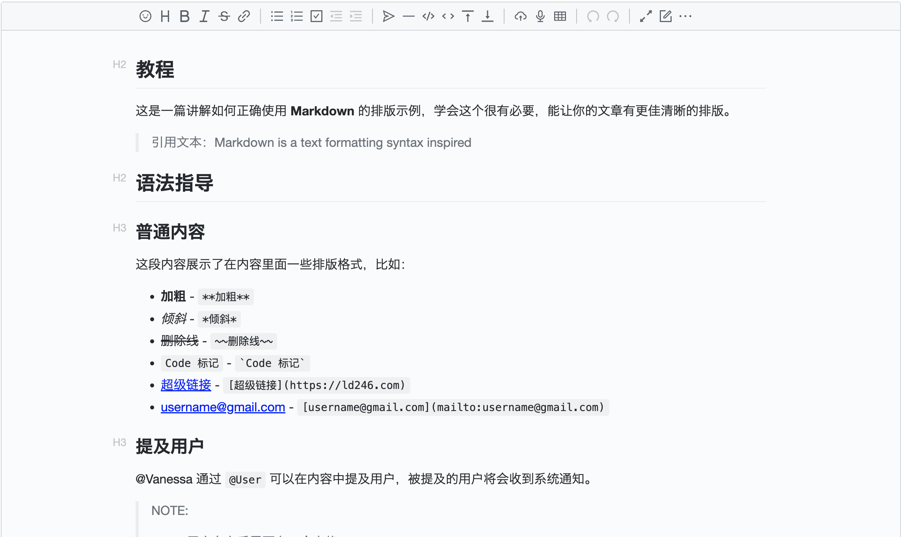

# Vditor

[Vditor](https://b3log.org/vditor) 是一款浏览器端的 Markdown 编辑器，支持所见即所得、即时渲染（类似 Typora）和分屏预览模式。它使用 TypeScript 实现，支持原生 JavaScript、Vue、React、Angular，提供[桌面版](https://b3log.org/siyuan)。


## 特性

- 支持三种编辑模式：所见即所得（wysiwyg）、即时渲染（ir）、分屏预览（sv）。
- 支持大纲、数学公式、脑图、图表、流程图、甘特图、时序图、五线谱、[多媒体](https://ld246.com/article/1589813914768)、语音阅读、标题锚点、代码高亮及复制、graphviz、PlantUML 渲染。
- 内置安全过滤、导出、图片懒加载、任务列表、多平台预览、多主题切换、获取内容、markdown和HTML相互转换等功能。
- 实现 CommonMark 和 GFM 规范，可对 Markdown 进行格式化和语法树查看，并支持[10+项](https://ld246.com/article/1549638745630#options-preview-markdown)配置。
- 工具栏包含 36+ 项操作，除支持扩展外还可对每一项中的[快捷键](https://ld246.com/article/1582778815353)、提示、提示位置、图标、点击事件、类名、子工具栏进行自定义。
- 表情/at/话题等自动补全扩展。
- 可使用拖拽、剪切板粘贴上传，显示实时上传进度，支持 CORS 跨域上传。
- 实时保存内容，防止意外丢失。
- 录音支持，用户可直接发布语音。
- 粘贴 HTML 自动转换为 Markdown，如粘贴中包含外链图片可通过指定接口上传到服务器。
- 支持主窗口大小拖拽、字符计数。
- 多主题支持，内置黑白两套主题。
- 多语言支持，内置中、英、繁体。
- 支持主流浏览器，对移动端友好。

## 语法支持

所有 CommonMark 语法：分隔线、ATX 标题、Setext 标题、缩进代码块、围栏代码块、HTML 块、链接引用定义、段落、块引用、列表、反斜杠转义、HTML 实体、行级代码、强调、加粗、链接、图片、行级 HTML、硬换行、软换行和纯文本。

所有 GFM 语法：表格、任务列表项、删除线、自动链接、XSS 过滤

常用 Markdown 扩展语法：脚注、ToC、自定义标题 ID

图表语法

- 流程图、时序图、甘特图，通过 Mermaid 支持
- Graphviz
- 折线图、饼图、脑图等，通过 ECharts 支持

五线谱：通过 abc.js 支持

数学公式：数学公式块、行级数学公式，通过 MathJax 和 KaTeX 支持

YAML Front Matter

中文语境优化

- 中西文之间插入空格
- 术语拼写修正
- 中文后跟英文逗号句号等标点替换为中文对应标点


## 用法

### 基础用法

```vue
<vditor
  ref="editor"
  :mode="form.mode"
  :value="form.value"
  :lang="form.lang"
  :min-height="form.minHeight"
  :width="form.width"
  :placeholder="form.placeholder"
  :debugger="form.debugger"
  :theme="form.theme"
  :icon="form.icon"
></vditor>

<script lang="ts">
  // ...
  
  import { LangType, ModeType, ThemeType, IconType } from '@/components/Editor/vditor/types'
  import { defineComponent } from 'vue'
  
  // ...
  
  export default defineComponent({
    setup() {
      const editor = ref()
      const vditorIns = computed(() => editor.value.vditorIns)

      let form = reactive({
        mode: 'ir' as ModeType,
        value: exampleMd,
        lang: 'zh_CN' as LangType,
        minHeight: 100,
        width: 'auto',
        placeholder: 'Please input here...',
        debugger: false,
        theme: 'classic' as ThemeType,
        icon: 'ant' as IconType
      })


      // ...

      return {
        editor,
        form,
        // ...
      }
    }
  })
</script>
```

效果如下：




### 高级用法

更多高级用法详见 [传送门](https://github.com/toimc-team/vue3-toimc-admin/blob/main/src/views/components/editor/vditor/index.vue)


## API

| 属性值      | 描述                                                         | 默认值    | 
| ----------- | ------------------------------------------------------------ | --------- | 
| mode        | 渲染模式，有三种分别为：所见即所得（`sv`）、即时渲染（`ir`）、分屏渲染（`wysiwyg`） | `ir`      |
| value       | 编辑器初始化值                                               | ''        |    
| lang        | 语言种类：`en_US`、` ja_JP`、` ko_KR`、` ru_RU`、` zh_CN`、` zh_TW` | `zh_CN`   |     
| minHeight   | 编辑区域最小高度                                             | 400       |     
| width       | 编辑器总宽度，支持 %                                         | `auto`    |    
| placeholder | 输入区域为空时的提示                                         | ''        |     
| debugger    | 是否显示日志                                                 | `false`   |     
| theme       | 主题，分别为：`classic`、`dark`                              | `classic` |    
| icon        | 图标风格，分别为：`ant`、`material`                          | `ant`     |     
| toolbar     | 工具栏配置项                                                 |           |

> 更多API 可查看 [官方文档](https://ld246.com/article/1549638745630#API)；示例中只用到了部分API，`props`中目前适配了常用的API，其他配置选项可通过`$attrs`方式传进去。

### toolbar

```js
const defaultToolbarItems = [
  'emoji',
  'headings',
  'bold',
  'italic',
  'strike',
  'link',
  '|',
  'list',
  'ordered-list',
  'check',
  'outdent',
  'indent',
  '|',
  'quote',
  'line',
  'code',
  'inline-code',
  'insert-before',
  'insert-after',
  '|',
  'upload',
  'record',
  'table',
  '|',
  'undo',
  'redo',
  '|',
  'fullscreen',
  'edit-mode',
  {
    name: 'more',
    toolbar: [
      'both',
      'code-theme',
      'content-theme',
      'export',
      'outline',
      'preview',
      'devtools'
      // 'info',
      // 'help'
    ]
  }
]
```

> `toolbar` 的更多配置项可查看 [官网文档](https://ld246.com/article/1549638745630#options-toolbar)。
