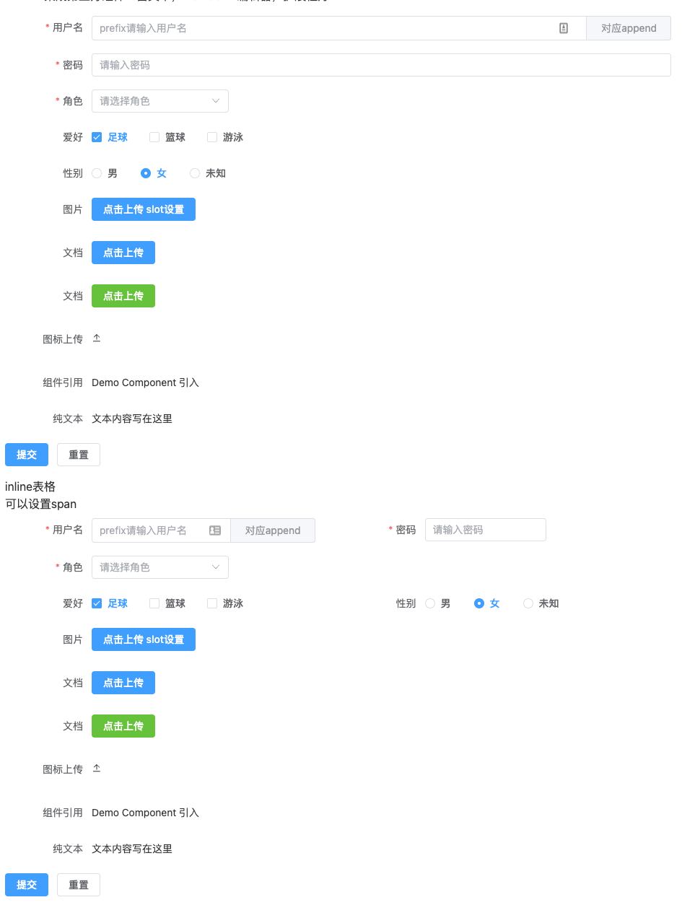

# 表单

设计思想&功能：

- 使用schema定制组件；
- 兼容upload功能；
- 多slot插槽兼容，重名兼容；
- 表单验证；
- inline模式支持栅栏系统；





## 基础表单

定制表单组件使用了schema的结构`@/components/Form/types/types`：

```typescript
export type FormSchema = {
  // 三种类型 ELement组件，纯文本，通用组件
  component: ComponentType | 'innerText' | Component
  // 默认值
  value?: any
  // 标签文本
  label?: string
  // 属性
  prop: string
  // 用于栅栏结构
  span?: number
  // element组件 slot，可以定义多个
  slot?: string | string[]
  // 当前组件的slot -> 针对 input 组件重新设计
  itemSlot?: string | { [key: string]: string }
  // 校验规则
  rules?: RuleItem[]
  // 额外绑定到item上的属性
  attrs?: any
  // 子组件
  children?: Partial<FormSchema>[]
  // item上的事件绑定
  events?: any
  // 额外的class
  class?: string
  // 额外的style属性
  style?: CSSProperties
  // 上传组件
  upload?: UploadComponent
}
```


上传组件：

```typescript
export type UploadComponent = {
  // 上传链接
  action?: string
  // 请求头
  headers?: object
  // 请求方式
  method?: 'post' | 'put' | 'patch'
  // 是否多文件
  multiple?: boolean
  // 数据
  data?: any
  // 文件名
  name?: string
  withCredentials?: boolean
  showFileList?: boolean
  // 拖拽功能是否开户
  drag?: boolean
  // 接受的文件类型
  accept?: string
  // 文件列表
  fileList?: any[]
  listType?: 'text' | 'picture' | 'picture-card'
  autoUpload?: boolean
  disabled?: boolean
  // 限制文件数量
  limit?: number
  type?: 'button' | 'icon'
  btnType?: 'primary' | 'success' | 'warning' | 'danger' | 'info' | 'text'
  text?: string
  class?: string
  icon?: string
  onChange?: (file: UploadFile, fileList: UploadFile[]) => void
  onRemove?: (file: UploadFile, fileList: UploadFile[]) => void
  onSuccess?: (response: any, file: UploadFile, fileList: UploadFile[]) => void
  onError?: (error: any, file: UploadFile, fileList: UploadFile[]) => void
  onProgress?: (
    evt: UploadProgressEvent,
    error: any,
    file: UploadFile,
    fileList: UploadFile[]
  ) => void
  onPreview?: (file: UploadFile) => void
  beforeUpload?: (file: UploadRawFile) => Awaitable<void | undefined | null | boolean | File | Blob>
  beforeRemove?: (uploadFile: UploadFile, uploadFiles: UploadFiles) => Awaitable<boolean>
  httpRequest?: UploadRequestHandler
  onExceed?: (files: File[], uploadFiles: UploadFiles) => void
}
```

其他属性与[element-plus官网](https://element-plus.gitee.io/zh-CN/component/upload#%E5%B1%9E%E6%80%A7)一致。


## Schema写法

```vue
<basic-form :schemas="formBasicSchema" label-width="120px">
  <template #upload1-trigger>
    <el-button type="primary">点击上传 slot设置</el-button>
  </template>
  <template #upload2-trigger>
    <el-button type="primary">点击上传</el-button>
  </template>
  <template #upload2-tip>
    <div class="el-upload__tip">jpg/png files with a size less than 500kb</div>
  </template>
  <template #haha> 对应append </template>
  <template #haha1> prefix </template>
</basic-form>

<basic-form :schemas="formBasicSchema" inline label-width="120px">
  <template #upload1-trigger>
    <el-button type="primary">点击上传 slot设置</el-button>
  </template>
  <template #upload2-trigger>
    <el-button type="primary">点击上传</el-button>
  </template>
  <template #upload2-tip>
    <div class="el-upload__tip">jpg/png files with a size less than 500kb</div>
  </template>
  <template #haha> 对应append </template>
  <template #haha1> prefix </template>
</basic-form>
```

其对应的schema如下：

```js
const formBasicSchema: FormSchema[] = [
  {
    component: 'input',
    value: '',
    label: '用户名',
    prop: 'name',
    rules: [{ required: true, message: '请输入用户名', trigger: 'blur' }],
    attrs: {
      placeholder: '请输入用户名'
    },
    itemSlot: { append: 'haha', prefix: 'haha1' },
    span: 12
  },
  {
    component: 'input',
    value: '',
    label: '密码',
    prop: 'password',
    rules: [
      {
        required: true,
        message: '密码不能为空',
        trigger: 'blur'
      },
      {
        min: 6,
        max: 16,
        message: '密码在6-16位',
        trigger: 'blur'
      }
    ],
    attrs: {
      placeholder: '请输入密码'
    },
    span: 12
  },
  {
    component: 'select',
    value: '',
    prop: 'role',
    label: '角色',
    rules: [
      {
        required: true,
        message: '请选择角色',
        trigger: 'change'
      }
    ],
    attrs: {
      placeholder: '请选择角色'
    },
    children: [
      {
        component: 'option',
        label: '管理员',
        value: 'admin'
      },
      {
        component: 'option',
        label: '用户',
        value: 'user'
      },
      {
        component: 'option',
        label: '测试',
        value: 'test'
      }
    ],
    span: 24
  },
  {
    component: 'checkbox-group',
    value: ['1'],
    prop: 'like',
    label: '爱好',
    rules: [],
    attrs: {},
    children: [
      {
        component: 'checkbox',
        label: '足球',
        value: '1',
        attrs: {
          disabled: true
        }
      },
      {
        component: 'checkbox',
        label: '篮球',
        value: '2'
      },
      {
        component: 'checkbox',
        label: '游泳',
        value: '3'
      }
    ],
    span: 12
  },
  {
    component: 'radio-group',
    value: '2',
    prop: 'gender',
    label: '性别',
    children: [
      {
        component: 'radio',
        label: '男',
        value: '1'
      },
      {
        component: 'radio',
        label: '女',
        value: '2'
      },
      {
        component: 'radio',
        label: '未知',
        value: '3'
      }
    ],
    span: 12
  },
  {
    component: 'upload',
    label: '图片',
    prop: 'file',
    // slotId
    slot: 'upload1',
    upload: {
      action: ''
    },
    span: 24
  },
  {
    component: 'upload',
    label: '文档',
    prop: 'file',
    slot: 'upload2',
    upload: {
      action: ''
    }
  },
  {
    component: 'upload',
    label: '文档',
    prop: 'file',
    upload: {
      type: 'button',
      btnType: 'success',
      text: '点击上传',
      action: ''
    },
    span: 24
  },
  {
    component: 'upload',
    label: '图标上传',
    prop: 'file',
    upload: {
      action: '',
      type: 'icon',
      onChange: (file, list) => {
        console.log(file, list)
      }
    },
    span: 24
  },
  {
    component: Demo,
    label: '组件引用',
    prop: 'demo',
    span: 24
  },
  {
    component: 'innerText',
    label: '纯文本',
    prop: 'inner',
    value: '文本内容写在这里',
    span: 24
  }
]
```


## 表单DOM写法

这种写法，即是使用element-plus官方组件进行书写，无schema结构，需要自己完成结构的输出。


## 分步表单


相对复杂的应用场景：

```vue
<template>
  <div>
    <div class="p-4 overflow-y-auto custom">
      <el-card>
        <template #header>
          <div class="flex justify-between items-center">
            <span class="flex-1">分步表单</span>
          </div>
        </template>
        <!-- 步骤条 -->
        <el-steps :active="active" align-center>
          <el-step title="第一步" description="填写转账信息" />
          <el-step title="第二步" description="确认转账信息" />
          <el-step title="第三步" description="完成" />
        </el-steps>
        <el-row justify="center" class="mt-10">
          <el-col :span="12">
            <basic-form
              v-if="active == 1"
              ref="formOne"
              :schemas="form.one"
              :label-width="labelWidth"
              :label-position="labelPosition"
              size="large"
            >
              <template #action="{ validate, model }">
                <el-button type="primary" @click="handleSubmitOne(validate, model)"
                  >下一步</el-button
                >
              </template>
            </basic-form>
            <el-form
              v-if="active == 2"
              :label-width="labelWidth"
              :label-position="labelPosition"
              size="large"
            >
              <el-form-item v-for="(item, index) in form.one" :key="index" :label="item.label">
                <el-input v-model="item['value']" disabled></el-input>
              </el-form-item>
              <el-form-item label="支付密码" prop="password">
                <el-input v-model="form.two.value" placeholder="输入支付密码" />
              </el-form-item>
              <el-form-item>
                <el-button :loading="loading" @click="handleSubmit">提交</el-button>
                <el-button type="primary" @click="handleClickPrev">上一步</el-button>
              </el-form-item>
            </el-form>
            <el-main v-if="active === 3">
              <el-result icon="success" title="转账成功">
                <template #extra>
                  <el-button type="primary">再转一笔</el-button>
                </template>
              </el-result>
            </el-main>
          </el-col>
        </el-row>
      </el-card>
    </div>
  </div>
</template>

<script lang="ts">
  import { defineComponent } from 'vue'
  import { ElMessage } from 'element-plus'

  export default defineComponent({
    name: 'StepForm',
    setup() {
      const loading = ref(false)
      const active = ref(1)
      const labelPosition = ref('right')
      const labelWidth = ref('120px')
      const form = reactive({
        one: [
          {
            component: 'input',
            value: '',
            label: '付款账户',
            prop: 'payment',
            rules: [{ required: true, message: '请输入付款账户号', trigger: 'blur' }],
            attrs: {
              placeholder: '付款账户号',
              clearable: true
            }
          },
          {
            component: 'input',
            value: '',
            label: '收款账户',
            prop: 'receive-payment',
            rules: [{ required: true, message: '请输入付款账户号', trigger: 'blur' }],
            attrs: {
              placeholder: '收款账户',
              clearable: true
            }
          },
          {
            component: 'input',
            value: '',
            label: '收款人姓名',
            prop: 'payee',
            rules: [{ required: true, message: '请输入收款人姓名', trigger: 'blur' }],
            attrs: {
              placeholder: '收款人姓名',
              clearable: true
            }
          },
          {
            component: 'input',
            value: '',
            label: '转账金额',
            prop: 'amount',
            rules: [{ required: true, message: '请输入转账金额', trigger: 'blur' }],
            attrs: {
              placeholder: '转账金额',
              clearable: true
            }
          }
        ],
        two: {
          component: 'input',
          value: '',
          label: '支付密码',
          prop: 'payment',
          rules: [{ required: true, message: '请输入支付密码', trigger: 'blur' }],
          attrs: {
            placeholder: '输入支付密码',
            clearable: true
          }
        }
      })

      const models = ref()

      function handleClickPrev() {
        if (active.value === 0) return
        active.value -= 1
      }

      async function handleSubmitOne(formEl, model) {
        console.log('formEl:', formEl)
        if (!formEl) return
        console.log('model:', model)
        formEl()
          .then((res) => {
            if (!res) return
            form.one = form.one.map((item) => {
              item.value = model[item.prop]
              return item
            })
            active.value += 1
          })
          .catch((error) => console.error('step one verification failed:', error))
      }

      function handleSubmit(forms: any) {
        console.log('forms:', forms)
        loading.value = true
        setTimeout(() => {
          loading.value = false
          ElMessage({
            type: 'success',
            message: '控制台查看打印数据'
          })
          active.value++
        }, 3000)
      }

      return {
        loading,
        active,
        labelPosition,
        labelWidth,
        form,
        models,
        handleClickPrev,
        handleSubmitOne,
        handleSubmit
      }
    }
  })
</script>

<style scoped lang=""></style>
```

