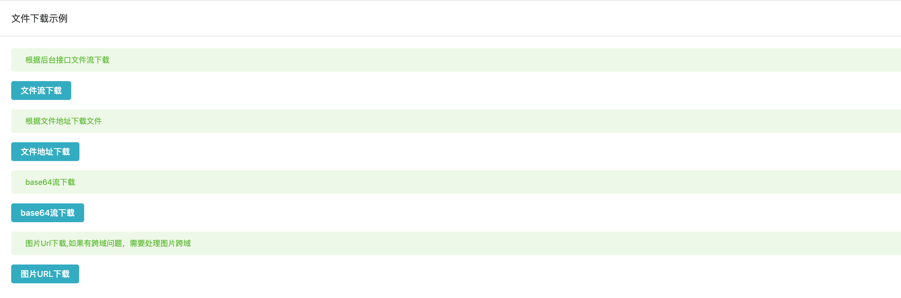

# 文件下载


## 效果



## 用法

```typescript
<template>
  <div class="p-4">
    <t-card header="文件下载示例">
      <el-alert title="根据后台接口文件流下载" type="success" :closable="false" />
      <el-row class="py-4">
        <el-button type="primary" @click="handleDownByData">文件流下载</el-button>
      </el-row>
      <el-alert title="根据文件地址下载文件" type="success" :closable="false" />
      <el-row class="py-4">
        <el-button type="primary" @click="handleDownloadByUrl">文件地址下载</el-button>
      </el-row>
      <el-alert title="base64流下载" type="success" :closable="false" />
      <el-row class="py-4">
        <el-button type="primary" @click="handleDownloadByBase64">base64流下载</el-button>
      </el-row>
      <el-alert
        title="图片Url下载,如果有跨域问题，需要处理图片跨域"
        type="success"
        :closable="false"
      />
      <el-row class="py-4">
        <el-button type="primary" @click="handleDownloadByOnlineUrl">图片URL下载</el-button>
      </el-row>
    </t-card>
  </div>
</template>

<script lang="ts">
  import { defineComponent } from 'vue'

  import {
    downloadByUrl,
    downloadByData,
    downloadByBase64,
    downloadByOnlineUrl
  } from '@/utils/file/download'

  import data from './base64-data'

  export default defineComponent({
    setup() {
      function handleDownByData() {
        downloadByData(
          'toimc项目地址：https://github.com/toimc-team/vue3-toimc-admin',
          'README.txt'
        )
      }
      function handleDownloadByUrl() {
        downloadByUrl({
          url: 'https://toimc-online.obs.cn-east-3.myhuaweicloud.com/vue-toimc-admin/shotcuts/image106.jpg',
          target: '_self'
        })

        downloadByUrl({
          url: 'https://toimc-online.obs.cn-east-3.myhuaweicloud.com/brian.jpg',
          target: '_self'
        })
      }

      function handleDownloadByBase64() {
        downloadByBase64(data, 'qrcode.png')
      }

      function handleDownloadByOnlineUrl() {
        downloadByOnlineUrl(
          'https://toimc-online.obs.cn-east-3.myhuaweicloud.com/vue-toimc-admin/shotcuts/image1.jpg',
          '美女.png'
        )
      }

      return {
        handleDownloadByUrl,
        handleDownByData,
        handleDownloadByBase64,
        handleDownloadByOnlineUrl
      }
    }
  })
</script>

```
