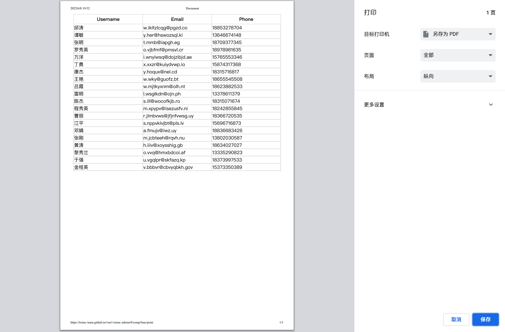
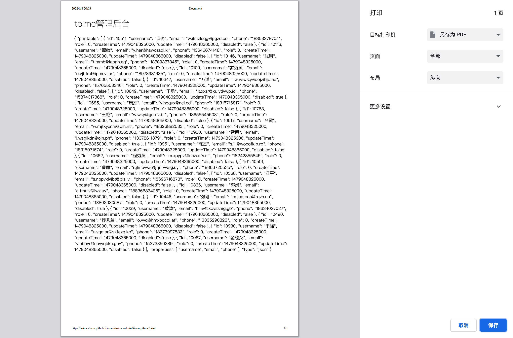

# 打印

扩展json打印、图片打印、html打印三种用法


## 效果

### json打印表格



### 图片打印


### html打印


## 用法

```typescript
<template>
  <div class="p-4">
    <t-card header="json打印表格">
      <div class="pb-4">
        <el-button type="primary" @click="jsonPrint">打印</el-button>
        <el-button type="primary" @click="imagePrint">图片打印</el-button>
        <el-button type="primary" @click="htmlPrint">HTML打印</el-button>
      </div>
      <el-row class="pb-2">
        
      </el-row>
      <el-row>
        <div class="pb-4 font-bold">JSON数据</div>
        <div ref="html">{{ json }}</div>
      </el-row>
    </t-card>
  </div>
</template>
<script lang="ts">
  import printJS from 'print-js'
  import axios from 'axios'

  interface User {
    id?: string
    username?: string
    email?: string
    phone?: string
    role?: number
    createTime?: number
    updateTime?: number
    disabled?: string
  }

  export default defineComponent({
    setup() {
      const transferData = ref([] as User[])
      const mockData = [
        'https://toimc-online.obs.cn-east-3.myhuaweicloud.com/vue-toimc-admin/shotcuts/pic1.jpg',
        'https://toimc-online.obs.cn-east-3.myhuaweicloud.com/vue-toimc-admin/shotcuts/pic2.jpg'
      ]

      async function getTansferData() {
        const res = await axios.get('/api/public/transfer')
        const { data } = res.data
        transferData.value.push(...data)
      }

      const json = ref({
        printable: transferData,
        properties: ['username', 'email', 'phone'],
        type: 'json'
      } as printJS.Configuration)

      const html = ref()

      function jsonPrint() {
        printJS(json.value)
      }

      function imagePrint() {
        printJS({
          printable: mockData,
          type: 'image',
          header: 'toimc管理后台',
          style: 'img{ width:100%; }'
        })
      }

      function htmlPrint() {
        printJS({
          printable: html.value,
          type: 'html',
          header: 'toimc管理后台'
        })
      }

      onMounted(() => {
        getTansferData()
      })

      return {
        jsonPrint,
        imagePrint,
        htmlPrint,
        mockData,
        html,
        json
      }
    }
  })
</script>
```