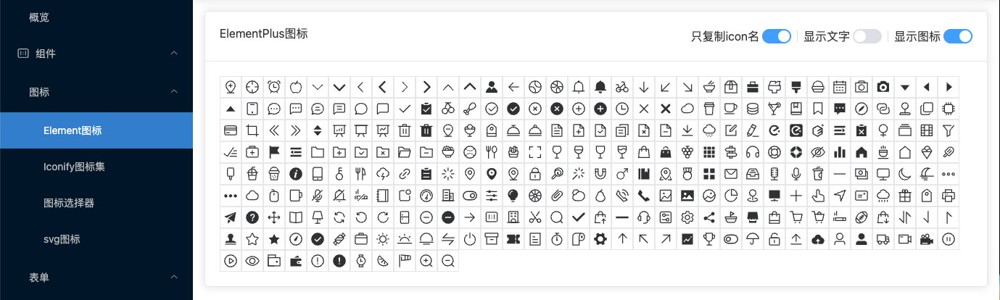
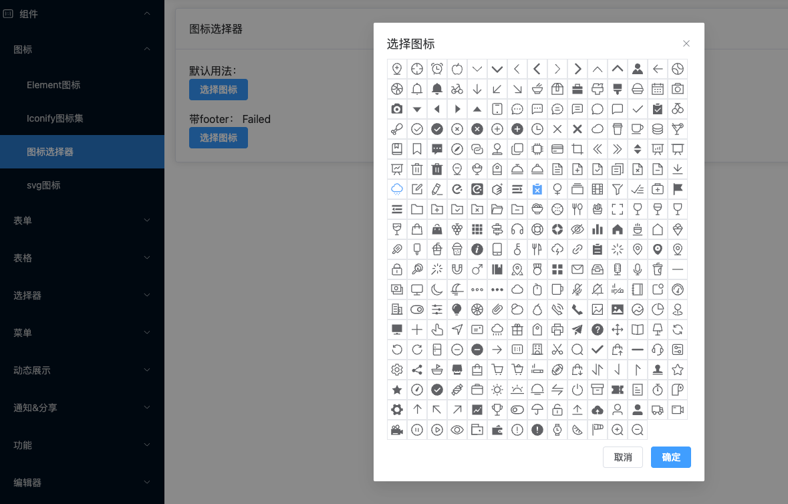

# 图标

平台内置了 `element-plus`的`icons`、`iconify`、`iconfont`(开发中)、`自定义svg`等，满足您`99.99%`的图标需求。

本项目集成了自动导入功能，所以在开发的过程中，可以放心大胆的使用图标库，在生产的时候会自动的tree shaking掉没有使用的内容。


## Element图标

导入Element所有图标的目的是后续会有一个图标选择器需要有数据：




示例代码：

```vue
<template>
  <div class="p-4 wrapper">
    <el-card>
      <template #header>
  			<!--属性控制-->
      </template>
      <icon-list
        :items="items"
        :show-icon="showIcon"
        :show-text="showText"
        :classes="classes"
        @click="handleCopy"
      ></icon-list>
    </el-card>
  </div>
</template>

<script lang="ts">
  import { IconData } from '@/components/Icon/data'
  import type { IconTypes } from '@/components/Icon/types'

  export default defineComponent({
    setup() {
      // ...

      return {
        items: IconData as IconTypes[],
        // ...
      }
    }
  })
</script>
```

数据源`@/components/Icon/data`，其实就是导入了所有Element-plus的图标：

```js
export const IconData = [
  'AddLocation',
  'Aim',
  'AlarmClock',
  'Apple',
  'ArrowDown',
  ...
```

其中的`icon-list`使用的是基础组件`icon`，基础组件兼容了iconfiy图标集。


## Iconify图标集

Vue官方主推，也是最全的图标集，官方地址：[https://iconify.design/](https://iconify.design/)

用法：

```vue
<template>
  <div class="p-4">
    <el-card header="iconify图标示意">
      <div>使用collections + type的组合(推荐)</div>
      <el-row justify="space-between">
        <icon collection="fa-regular" type="angry" size="24px" color="red" />
        <icon collection="mdi" type="access-point" size="28px" color="blue" />
        <icon collection="bi" type="arrow-down-left-square-fill" size="28px" color="blue" />
        <icon collection="ant-design" type="audio-outlined" size="2rem" color="blue" />
      </el-row>
      <div>直接使用icon(懒人适合)</div>
      <el-row>
        <icon icon="bi:arrow-clockwise" size="4em" color="green" />
        <icon icon="logos:ant-design" size="2rem" color="red" />
        <icon icon="ant-design:android-filled" size="1.5rem" color="purple" />
        <icon icon="ant-design:ant-design-outlined" size="1.5rem" color="green" />
      </el-row>
      <div>使用vite插件直接使用 i 标签</div>
      <el-row>
        <i-carbon-accessibility />
        <i-mdi-account-box style="font-size: 2em; color: red;" />
      </el-row>
    </el-card>
  </div>
</template>
```

属性说明：

```js
// 图标集
collection: {
  type: String,
  default: 'ep'
},
// 颜色
color: {
  type: String,
  default: 'auto'
},
// 大小，支持字符串
size: {
  type: String,
  default: ''
},
// 类型，配合collection进行使用
type: {
  type: String,
  default: ''
},
// 额外设置样式
classes: {
  type: String,
  default: ''
},
// 直接设置icon名称，设置后会覆盖collection的type
icon: {
  type: String,
  default: ''
}
```


## svg图标

集成`vite-plugin-svg-icons`，在`vite.config.ts`中进行设置svg的图标目录：

```js
createSvgIconsPlugin({
  // 指定需要缓存的图标文件夹
  iconDirs: [pathResolve('src/assets/svg')],
  // 指定symbolId格式
  symbolId: 'icon-[dir]-[name]'
}),
```

然后就可以在该目录中放入svg的图片。

在页面中使用的方式：

```vue
<template>
  <div class="p-4 wrapper">
    <el-card header="svg图标集成">
    <svg-icon icon-class="example-27" size="20rem"></svg-icon>
    <svg-icon icon-class="example-3" width="220px" height="110px"></svg-icon>
    </el-card>
  </div>
</template>
```

使用`svg-icon`组件，然后可以设置如下属性：

```js
// 图标类名
iconClass: {
  type: String,
  required: true
},
// svg图标的类名
className: {
  type: String,
  default: ''
},
// 宽度
width: {
  type: [Number, String],
  default: ''
},
// 高度
height: {
  type: [Number, String],
  default: ''
},
// 如果设置了size，可以不用设置width和height
size: {
  type: [Number, String],
  default: ''
}
```


## 图标选择器

默认的数据源为Element-plus的图标数据源。



支持的属性：

```js
// 当前选中的图标
choose: {
  type: [String, Number],
  default: ''
},
// 标题
title: {
  type: String,
  default: '选择图标'
},
// 图标庥
items: {
  type: Array as PropType<IconTypes[]>,
  default: () => IconData
},
// 是否显示图标
showIcon: {
  type: Boolean,
  default: true
},
// 是否显示文字
showText: {
  type: Boolean,
  default: false
},
// 是否显示控制按钮
footer: {
  type: Boolean,
  default: false
},
// 设置图标列表的类名
classes: {
  type: String,
  default: 'p-1'
}
```

