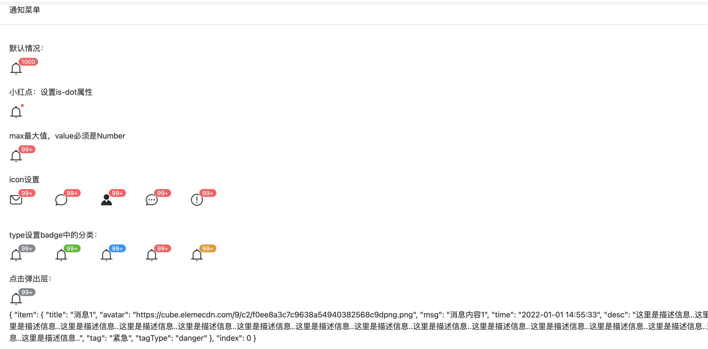

# 通知菜单

二次封装`element-plus`的`el-badge`组件，扩展更多用法

## 效果



## 基础用法

```typescript
<template>
  <div class="p-4">
    <el-card header="通知菜单">
      <div class="py-4">默认情况：</div>
      <notification value="1000"></notification>
      <br />
      <div class="py-4">小红点：设置is-dot属性</div>
      <notification value="1000" is-dot></notification>
      <br />
      <div class="py-4">max最大值，value必须是Number</div>
      <notification :value="1000" :max="99"></notification>
      <br />
      <div class="py-4">icon设置</div>
      <div class="w-[400px] flex justify-between">
        <notification :value="1000" :max="99" icon="Message"></notification>
        <notification :value="1000" :max="99" icon="ChatRound"></notification>
        <notification :value="1000" :max="99" icon="Avatar"></notification>
        <notification :value="1000" :max="99" icon="ChatDotRound"></notification>
        <notification :value="1000" :max="99" icon="Warning"></notification>
      </div>
      <br />
      <div class="py-4">type设置badge中的分类：</div>
      <div class="w-[400px] flex justify-between">
        <notification :value="1000" :max="99" type="info"></notification>
        <notification :value="1000" :max="99" type="success"></notification>
        <notification :value="1000" :max="99" type="primary"></notification>
        <notification :value="1000" :max="99" type="danger"></notification>
        <notification :value="1000" :max="99" type="warning"></notification>
      </div>
      <div class="py-4">点击弹出层：</div>
      <div class="w-[400px] flex justify-between">
        <notice-pad :value="1000" :max="99" type="info">
          <message-list :actions="actions" :lists="lists" @click-item="handleClick"></message-list>
        </notice-pad>
      </div>
      <div>{{ clickItem }}</div>
    </el-card>
  </div>
</template>

<script lang="ts">
  import { ActionOptions, MessageListItem, MessageListOptions } from '@/components/List/types'

  export default defineComponent({
    setup() {
      const actions = ref([
        {
          title: '清空',
          icon: 'Delete'
        },
        {
          title: '更多',
          icon: 'More'
        }
      ] as ActionOptions[])

      const lists = ref([
        {
          title: '通知',
          content: [
            {
              title: '消息1',
              avatar: 'https://cube.elemecdn.com/9/c2/f0ee8a3c7c9638a54940382568c9dpng.png',
              msg: '消息内容1',
              time: '2022-01-01 14:55:33',
              desc: '这里是描述信息..这里是描述信息..这里是描述信息..这里是描述信息..这里是描述信息..这里是描述信息..这里是描述信息..这里是描述信息..这里是描述信息..这里是描述信息..这里是描述信息..这里是描述信息..这里是描述信息..这里是描述信息..这里是描述信息..这里是描述信息..',
              tag: '紧急',
              tagType: 'danger'
            },
            {
              title: '消息1',
              avatar: 'https://cube.elemecdn.com/9/c2/f0ee8a3c7c9638a54940382568c9dpng.png',
              msg: '消息内容1',
              time: '2022-01-01 14:55:33'
            },
            {
              title: '消息1',
              avatar: 'https://cube.elemecdn.com/9/c2/f0ee8a3c7c9638a54940382568c9dpng.png',
              msg: '消息内容1',
              time: '2022-01-01 14:55:33'
            }
          ]
        },
        {
          title: '关注',
          content: [
            {
              title: '消息3',
              avatar: 'https://cube.elemecdn.com/9/c2/f0ee8a3c7c9638a54940382568c9dpng.png',
              msg: '消息内容1',
              time: '2022-01-01 14:55:33'
            },
            {
              title: '消息3',
              avatar: 'https://cube.elemecdn.com/9/c2/f0ee8a3c7c9638a54940382568c9dpng.png',
              msg: '消息内容3',
              time: '2022-01-01 14:55:33',
              tag: '通知',
              tagType: 'info'
            },
            {
              title: '消息3',
              avatar: 'https://cube.elemecdn.com/9/c2/f0ee8a3c7c9638a54940382568c9dpng.png',
              msg: '消息内容1',
              time: '2022-01-01 14:55:33'
            }
          ]
        },
        {
          title: '待办',
          content: [
            {
              title: '消息2',
              avatar: 'https://cube.elemecdn.com/9/c2/f0ee8a3c7c9638a54940382568c9dpng.png',
              msg: '消息内容1',
              time: '2022-01-01 14:55:33'
            },
            {
              title: '消息2',
              avatar: 'https://cube.elemecdn.com/9/c2/f0ee8a3c7c9638a54940382568c9dpng.png',
              time: '2022-01-01 14:55:33',
              tag: '通知',
              tagType: 'info'
            },
            {
              title: '消息2',
              avatar: 'https://cube.elemecdn.com/9/c2/f0ee8a3c7c9638a54940382568c9dpng.png',
              msg: '消息内容1',
              time: '2022-01-01 14:55:33'
            }
          ]
        }
      ] as MessageListOptions[])

      const clickItem = ref()
      const handleClick = (item: MessageListItem, index) => {
        console.log('🚀 ~ file: index.vue ~ line 137 ~ handleClick ~ index', index)
        clickItem.value = item
      }
      return {
        actions,
        lists,
        clickItem,
        handleClick
      }
    }
  })
</script>
```


## 属性

| 属性       | 描述             | 类型    | 可选值 | 默认值 |
| :--------- | :--------------- | :------ | :----- | :----- |
| size      | 大小       | string  | —      |  28px      |
| icon | 自定义图标   | string  | —      |     Bell   |
| value    | 显示值 | number｜string | —      | —   |
| max    | 最大值，超过最大值会显示 {max}+。 只有当 value 是数字类型时才会工作 | number | —      | Infinity  |
| isDot    | 是否显示小圆点 | boolean | —      | false  |
| type    | 类型 | string | 'primary' ｜ 'success' ｜ 'warning' ｜ 'danger' ｜ 'info'    | 'danger'  |
| width    | 宽度 | number | —      | 300  |
| trigger    | 触发的行为 | string | click｜hover    | click  |


