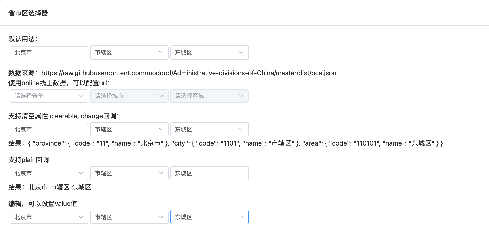

# 省市区选择器

省市区选择器功能特点：

- 通过`element-plus`中的`el-select`组件实现省市区三级联动

## 效果


## 基本用法


```typescript
<template>
  <div class="p-4">
    <el-card header="省市区选择器">
      <div class="pb-4">
        <div>默认用法：</div>
        <choose-area></choose-area>
      </div>
      <div class="pb-4">
        <div>
        数据来源：https://raw.githubusercontent.com/modood/Administrative-divisions-of-China/master/dist/pca.json
        </div>
        <div>使用online线上数据，可以配置url：</div>
        <choose-area online></choose-area>
      </div>
      <div class="pb-4">
        <div>支持清空属性 clearable, change回调：</div>
        <choose-area clearable @change="(e) => (chooseVal = e)"></choose-area>
        <div>结果：{{ chooseVal }}</div>
      </div>
      <div class="pb-4">
        <div>支持plain回调</div>
        <choose-area clearable plain @change="(e) => (chooseVal1 = e)"></choose-area>
        <div>结果：{{ chooseVal1 }}</div>
      </div>
      <div>
        <div>编辑，可以设置value值</div>
        <choose-area
          clearable
          plain
          :value="{
            province: { code: '12', name: '天津市' },
            city: { code: '1201', name: '市辖区' },
            area: { code: '120102', name: '河东区' }
          }"
        ></choose-area>
      </div>
    </el-card>
  </div>
</template>

<script lang="ts">
export default defineComponent({
  setup() {
    const chooseVal = ref('')
    const chooseVal1 = ref('')

    return {
      chooseVal,
      chooseVal1
    }
  }
})
</script>
```

## 属性

| 属性       | 描述             | 类型    | 可选值 | 默认值 |
| :--------- | :--------------- | :------ | :----- | :----- |
| lists      | 数据       | array  | —      | allAreas(本地文件)       |
| value | 自定义value值   | object  | —      |    —      |
| url    | 数据来源 | string | —      | [数据链接](https://github.91chi.fun/https://raw.githubusercontent.com/modood/Administrative-divisions-of-China/master/dist/pca.json)  |
| online    | 是否使用线上数据 | boolean | —      | false  |
| clearable    | 是否启用清空属性 | boolean | —      | false  |
| plain    | 是否支持plain回调 | boolean | —      | false  |

## 事件


| 事件名 | 说明                                               | 参数            |
| :----- | :------------------------------------------------- | :-------------- |
| change | 值改变时触发 | val，新状态的值 |
