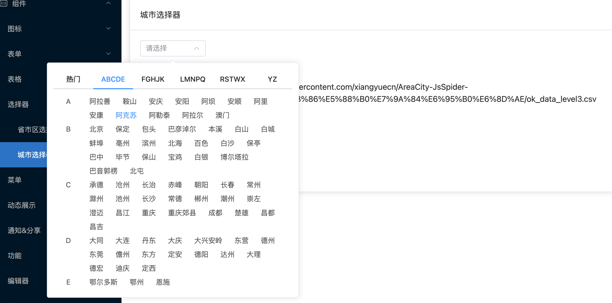

# 城市选择器

城市选择器功能特点：

- 动态数据来源
- 汉字转拼音，会有多音字
- 自动补全与`el-tabs`组合




## 基本用法

```typescript
<template>
  <div class="p-4">
    <el-card header="城市选择器">
      <choose-city></choose-city>
      <br />
      <choose-city online></choose-city>
    </el-card>
  </div>
</template>

```

## 属性

| 属性       | 描述             | 类型    | 可选值 | 默认值 |
| :--------- | :--------------- | :------ | :------- | :----- |
| data      | 城市数据       | array  | —      |  allAreas(本地文件)     |
| value | 自定义value值   | string  | —      |    —     |
| online    | 是否使用线上数据 | boolean | —      | false  |
| url    | 数据来源 | string | —      | [数据链接](https://github.91chi.fun/https://raw.githubusercontent.com/xiangyuecn/AreaCity-JsSpider-StatsGov/master/src/%E9%87%87%E9%9B%86%E5%88%B0%E7%9A%84%E6%95%B0%E6%8D%AE/ok_data_level3.csv)  |
| autoComplete    | 自动补全 | boolean | —      | true  |
| hotCitys    | 热门城市 | array | —      | '北京','上海','广州','成都',<br />'重庆','西安','昆明','深圳',<br />'杭州','厦门','长沙','海口',<br />'武汉','乌鲁木齐','郑州',<br />'三亚','贵阳','南京','青岛','哈尔滨'  |
| width    | 选择器宽度 | string | —      | 130px  |


## 事件


| 事件名 | 说明                                               | 参数            |
| :----- | :------------------------------------------------- | :-------------- |
| change | 值改变时触发 | val，新状态的值 |


