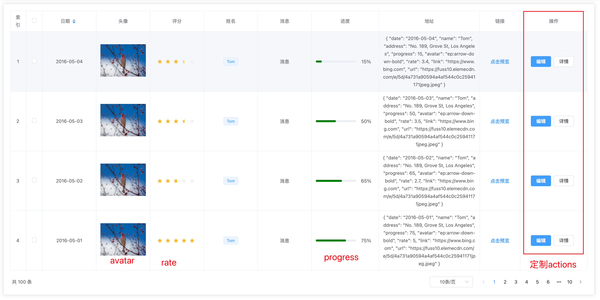

# 表格

表格组件功能特点：

- 整合了`element-plus`中的`el-table`、`el-pagination`；

- 在`column`部分，整合常见的`index`, `checkbox`；
- 支持进度条`el-progress`、头像`el-avatar`、徽章`el-badge`类型




## 表格定义

```typescript
export interface ColumnOptions {
  // 列名
  label: string
  // 数据对应的key
  prop?: string
  width?: string | number
  height?: string | number
  align?: 'left' | 'right' | 'center'
  // 插槽名
  slot?: string
  fixed?: boolean | 'left' | 'right'
  // 操作列 -> 可以支持icon与button
  actionItems?: ActionType[]
  type?: ColumnTypes
  // 数据格式化
  format?: (value: any, row: any) => any
  // 额外属性
  attrs?: any
}
```


例如最上面的表格可以如下方式进行定义：

```typescript
const columns = [
  {
    label: '索引',
    type: 'index',
    align: 'center'
  },
  {
    type: 'selection',
    align: 'center'
  },
  {
    label: '日期',
    prop: 'date',
    align: 'center',
    attrs: {
      sortable: true
    }
  },
  {
    label: '头像',
    prop: 'url',
    align: 'center',
    type: 'image'
  },
  {
    label: '评分',
    prop: 'rate',
    align: 'center',
    type: 'rate'
  },
  {
    label: '姓名',
    prop: 'name',
    align: 'center',
    type: 'tag'
  },
  {
    label: '消息',
    prop: 'badge',
    align: 'center',
    type: 'badge'
  },
  {
    label: '进度',
    prop: 'progress',
    align: 'center',
    type: 'progress',
    width: 200,
    attrs: {
      // status与format互斥
      color: 'green'
    },
    format: (value) => {
      return `${value}%`
    }
  },
  {
    label: '地址',
    prop: 'address',
    align: 'center',
    slot: 'address',
    width: 300
  },
  {
    label: '链接',
    prop: 'link',
    align: 'center',
    type: 'link',
    width: 120
  },
  {
    label: '操作',
    align: 'center',
    action: true,
    fixed: 'right',
    width: 200,
    actionItems: [
      {
        type: 'button',
        attrs: {
          type: 'primary'
        },
        text: '编辑',
        click: (scope) => {
          console.log(scope)
        }
      },
      {
        type: 'button',
        text: '详情',
        click: (scope) => {
          console.log(scope)
        }
      }
    ]
  }
] as ColumnOptions[]
```


## 插槽

```vue
<basic-table
  ref="table"
  :data="tableData"
  :columns="columns"
  :pagination="pagination"
  :default-sort="{ prop: 'date', order: 'descending' }"
>
  <template #address="{ row }">{{ row }}</template>
</basic-table>
```


插槽可以自定义名称：

```
...

  {
    label: '地址',
    prop: 'address',
    align: 'center',
    slot: 'address',
    width: 300
  },
  
...
```

插槽可以获取的数据`{ row, column, $index }`，同[官方](https://element-plus.gitee.io/zh-CN/component/table.html#table-column-%E6%8F%92%E6%A7%BD)。


## 分页功能

此部分，直接对接了element-plus中的分页功能，小伙伴们可以直接按照[官方手册](https://element-plus.gitee.io/zh-CN/component/pagination.html)进行使用。


## 源代码

[组件](https://github.com/toimc-team/vue3-toimc-admin/blob/main/src/components/Table/BasicTable.vue)

