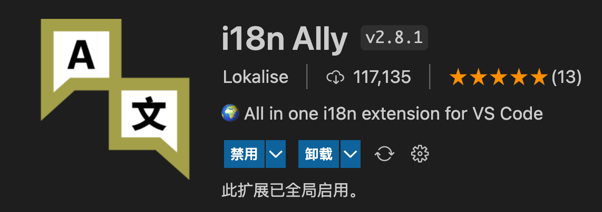
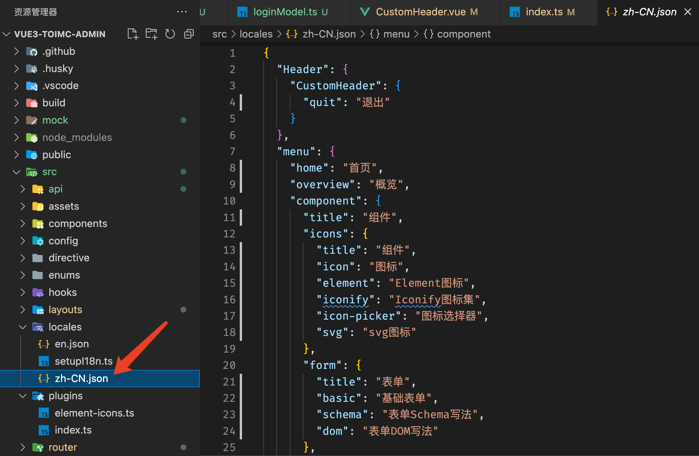
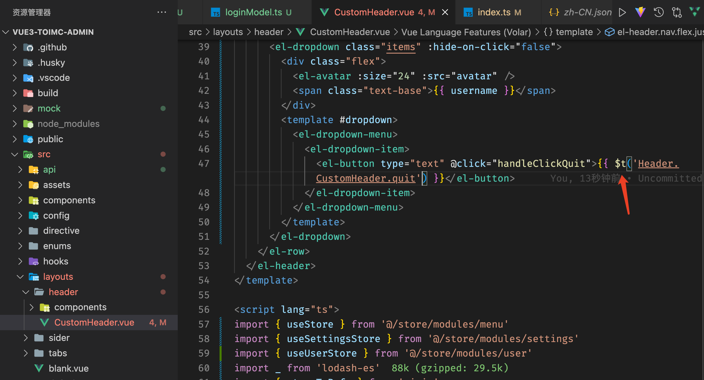

# 国际化


内置了国际化，支持自定义国际化、element-plus 国际化

> vscode 插件
>
> 如果您使用的编辑器是 `vscode` 请安装插件 `i18n Ally` 以便带来更友好的国际化提示 
>
> 

## 注入国际化

使用 [@intlify/vite-plugin-vue-i18n](https://www.npmjs.com/package/@intlify/vite-plugin-vue-i18n) 这个国际化 `vite` 插件配合 [vue-i18n](https://www.npmjs.com/package/vue-i18n) 来实现国际化，采用了 `json` 格式；当然这款国际化 `vite` 插件还支持 `yaml` 格式，具体看 [vite-plugin-vue-i18n/README.md](https://github.com/intlify/bundle-tools/blob/main/packages/vite-plugin-vue-i18n/README.md#include)





如上图：中文添加到 `zh-CN.json` 文件里，英文添加到 `en.json` 文件里 使用方法如下：

```js
$t('Header.CustomHeader.quit')
```

> 因为在 main.ts 文件中初始化了 i18n，一般是在template中直接使用 `$t `
>
> ```ts
> async function bootstrap() {
>   const app = createApp(App)
> 
>   // ...
>   
>   // Multilingual configuration
>   // Asynchronous case: language files may be obtained from the server side
>   await setupI18n(app)
>   
>   // ..
>   
>   app.mount('#app')
> }
> 
> bootstrap()
> ```


## 用法

> 如何配合 `i18n Ally` 插件带来智能提示（无实际意义，只对提示起作用）

- 在 ts 文件中使用，`useI18n`必须在`setup`中使用[vue-i18n](https://vue-i18n.intlify.dev/guide/migration/vue3.html#usei18n-in-vue-component)文档`useI18n in Vue Component`

  ```ts
  import { useI18n } from 'vue-i18n';
  
  const { t } = useI18n()
  const title = t('menu.component.title')
  ```

- 在 vue 文件中就直接使用 `$t()`

  ```vue
  <template>
    <el-menu-item :index="getIndex(item)" @click="(e) => handleMenuClick(e, item)">
      <icon v-if="item?.meta?.icon" class="menu-icon" :type="getIcons(item)" />
      <template #title>{{ $t(item.meta?.title) }}</template>
    </el-menu-item>
  </template>
  ```

- 国际化函数、方法

  `useI18n`必须在`setup`中使用[vue-i18n ](https://vue-i18n.intlify.dev/guide/migration/vue3.html#usei18n-in-vue-component)文档`useI18n in Vue Component`

  ```sh
  import { useI18n } from "vue-i18n";
  const { t } = useI18n();
  {{ t(item.text) }}
  ```

  
