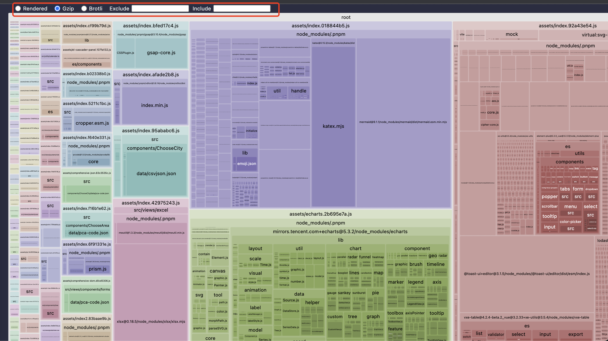

# 构建与部署

:::tip
由于是展示项目，所以打包后相对较大，项目中不需要的插件，可以删除对应的文件或者路由，不引用即可，**没有引用就不会打包**。
:::

## 构建

项目开发完成之后，执行以下命令进行构建。

```sh
# with yarn
yarn build

# with pnpm
pnpm build
```

构建打包成功之后，会在根目录生成 `dist` 文件夹，里面就是构建打包好的文件。

### 预览

发布之前可以在本地进行预览，有多种方式，这里介绍两种。

**不能**直接打开构建后的 **html** 文件

- 使用项目自定义命令进行预览（推荐）

```sh
# 先打包在进行预览
yarn preview

# or use "pnpm preview"

# 直接预览本地 dist 文件目录
yarn preview:dist

# or use "pnpm preview:dist"
```

- 使用 `live-server` 进行预览

将`.env.production`中，设置**public path** 

```sh
# public path
VITE_PUBLIC_PATH=/
```

使用 `yarn` 或者 `pnpm` 进行打包

```sh
yarn build

# or use pnpm "pnpm build"
```

安装 **live-server**

```sh
npm i -g live-server
```

进行本地预览

```sh
# 进入build目录
cd dist
# 启动服务
live-server
# 或者也可以指定端口启动
live-server --port=9000
```


### 兼容旧版浏览器

在 `.env.production` 内

设置 `VITE_LEGACY=true` 即可打包出兼容旧版浏览器的代码

```ts
# Is it compatible with older browsers
VITE_LEGACY = true
```


### 分析构建文件体积

如果你的构建文件很大，进行通过运行 `yarn report` 命令，进行代码**体积分析**，从而优化你的代码。

运行之后，在自动打开的页面可以看到具体的体积分布，以分析哪些依赖有问题。

:::tip
左上角可以切换显示 **Gzip** 或者 **Brotli**。
:::




## 压缩

### 开启 gzip 压缩

开启 `gzip`，结合 `nginx` 将大大加快页面访问速度。

```sh
# Whether to enable gzip or brotli compression
# Optional: gzip | brotli | none
# If you need multiple forms, you can use `,` to separate
VITE_BUILD_COMPRESS = 'gzip'
```


### 开启 brotli 压缩

`brotli` 是比 `gzip` 压缩率更高的算法，可以与 `gzip` 共存**不会冲突**，需要 `nginx` 安装指定模块并开启即可。

```sh
# Whether to enable gzip or brotli compression
# Optional: gzip | brotli | none
# If you need multiple forms, you can use `,` to separate
VITE_BUILD_COMPRESS = 'brotli'
```


### 同时开启 gzip 与 brotli

二者同时开启，即可在打包的同时生成 `.gz` 和 `.br` 文件。

```sh
# Whether to enable gzip or brotli compression
# Optional: gzip | brotli | none
# If you need multiple forms, you can use `,` to separate
VITE_BUILD_COMPRESS = 'brotli,gzip'
```


### gzip 与 brotli 在 nginx 内的配置

```sh
http {
  # 开启gzip
  gzip on;
  # 开启gzip_static
  # gzip_static 开启后可能会报错，需要安装相应的模块, 具体安装方式可以自行查询
  # 只有这个开启，vue文件打包的.gz文件才会有效果，否则不需要开启gzip进行打包
  gzip_static on;
  gzip_proxied any;
  gzip_min_length 1k;
  gzip_buffers 4 16k;
  #如果nginx中使用了多层代理 必须设置这个才可以开启gzip。
  gzip_http_version 1.0;
  gzip_comp_level 2;
  gzip_types text/plain application/javascript application/x-javascript text/css application/xml text/javascript application/x-httpd-php image/jpeg image/gif image/png;
  gzip_vary off;
  gzip_disable "MSIE [1-6]\.";

  # 开启 brotli压缩
  # 需要安装对应的nginx模块,具体安装方式可以自行查询
  # 可以与gzip共存不会冲突
  brotli on;
  brotli_comp_level 6;
  brotli_buffers 16 8k;
  brotli_min_length 20;
  brotli_types text/plain text/css application/json application/x-javascript text/xml application/xml application/xml+rss text/javascript application/javascript image/svg+xml;
}
```


## 部署

### 通过nginx简单发布

简单的部署只需要将最终生成的**静态文件**，`dist` 文件夹的静态文件发布到你的服务器即可，需要注意的是其中的 `index.html` 通常会是你后台服务的入口页面，这里需要格外注意静态文件 `js` 和 `css` 的**路径**。

例如使用 `nginx` 部署，将文件上传至 `/usr/share/nginx/html` .

```sh
location / {
  # 这里是vue打包文件dist内的文件的存放路径
  root /usr/share/nginx/html;
  index index.html index.htm;
}
```

部署时可能会发现资源路径不对，只需要修改 `.env.production` 文件即可。

```sh
# 根据自己路径来配置更改
# 注意需要以 / 开头和结尾
# public path
VITE_PUBLIC_PATH=/
```


### 前端路由与服务端的结合

项目前端路由使用的是 `vue-router`，所以你可以选择两种方式：`history` 和 `hash` .

`hash` 默认会在 `url` 后面拼接`#`.

`history` 则不会，不过 `history` 需要服务器配合.

可在 `src/router/index.ts` 内进行 `mode` 修改。

```ts
import { createRouter, createWebHashHistory, createWebHistory } from 'vue-router'

const router = createRouter({
  history: createWebHashHistory(),
   // or
  history: createWebHistory(),
})
```

### `history` 路由模式下服务端配置

修改`.env`文件，来修改路由默认的模式：

```
# 根据自己应用场景来配置
# Optional: hash | html5
VITE_APP_ROUTE_MODE = "hash"
```


开启 `history` 模式需要服务器配置，否则刷新会报**404**。

这里以 `nginx` 配置为例

```sh
location / {
  root /usr/share/nginx/html;
   # 用于配合 History 使用
  try_files $uri $uri/ @router;
  index index.html index.htm;
}

location @router {
  rewrite ^.*$ /index.html last;
}

# 或者

location / {
  # 用于配合 History 使用
  try_files $uri $uri/ /index.html;
}
```


## 常见问题

### 使用nginx处理跨域

使用 nginx 处理项目部署后的跨域问题

- 配置前端项目接口地址

```
# 在.env.production内，配置接口地址
VITE_GLOB_API_URL=/api
```

- 在 nginx 配置请求转发到后台

```
server {
  listen       8080;
  server_name  www.yourdomain.com;
  
  # 接口代理，用于解决跨域问题
  location /api {
    proxy_set_header Host $host;
    proxy_set_header X-Real-IP $remote_addr;
    proxy_set_header X-Forwarded-For $proxy_add_x_forwarded_for;

		# 后台接口地址，可以是域名，也可以是IP
    proxy_pass http://yourhost.com.or.ip/api;
    proxy_redirect default;
    
    add_header Access-Control-Allow-Origin *;
    add_header Access-Control-Allow-Headers X-Requested-With;
    add_header Access-Control-Allow-Methods GET,POST,OPTIONS;
  }
}
```


### 减少项目体积

思路通过CND加速：

- 使用CDN加速之后，在`index.html`中进行配置；

- 使用vite打包时，可以添加`optimizeDeps.exclude`属性，来忽略部分包的引入；

  ```tsx
  export default defineConfig({
    // ...
    optimizeDeps: {
      exclude: [      
      	"react",
        "react-dom"
      ]
    }
  })
  ```

  
