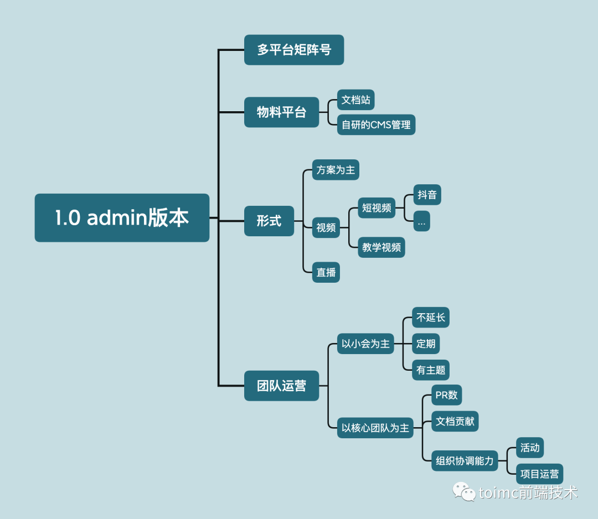

# 介绍

## 简介

[vue-toimc-admin](https://github.com/toimc-team/vue3-toimc-admin) 是一个基于 [vue3](https://github.com/vuejs/core)、[vite](https://github.com/vitejs/vite)、 [element-plus](https://github.com/element-plus/element-plus)、[TypeScript](https://www.typescriptlang.org/) 的管理后台解决方案，目标是为中大型项目开发，提供现成的开箱解决方案及丰富的示例，同时开源版本不会限制任何代码用于商用。


产品规划：




## 关于文档站

::: tip

如发现文档有误，欢迎提 pr 帮助我们改进。

:::

- 中文文档地址为 [vue-toimc-admin](https://toimc-team.github.io/vue3-toimc-admin-doc/)，采用 Vuepress 2.x开发；
- 英文文档关注后续；


### 本地运行文档

如需本地运行文档，请拉取代码到本地。

```shell
# 拉取代码
$ git clone https://github.com/toimc-team/vue3-toimc-admin-doc.git

# 安装依赖
$ pnpm install

# 运行项目
$ pnpm dev
```


## 需要掌握的基础知识

本项目需要一定前端基础知识，请确保掌握 Vue 的基础知识，以便能处理一些常见的问题。 建议在开发前先学一下以下内容，提前了解和学习这些知识，会对项目理解非常有帮助:

- [Vue3 文档](https://vuejs.org/)
- [Vue-RFCS](https://github.com/vuejs/rfcs)
- [Vue2 迁移到 3](https://v3-migration.vuejs.org/)
- [TypeScript](https://www.typescriptlang.org/)
- [Vue-router](https://router.vuejs.org/)
- [Element-plus](https://github.com/element-plus/element-plus)
- [ES6](https://es6.ruanyifeng.com/)
- [Vitejs](https://vitejs.dev/)
- [WindiCss](https://windicss.netlify.app/)


## 浏览器支持

使用`vite-plugin-legacy`插件，增加浏览器对ESM语法的支持。

**本地开发**推荐使用`Chrome 最新版`浏览器，**不支持**`Chrome 80`以下版本。

**生产环境**支持现代浏览器，不支持 IE。

| [](http://godban.github.io/browsers-support-badges/)IE | [](http://godban.github.io/browsers-support-badges/)Edge | [](http://godban.github.io/browsers-support-badges/)Firefox | [](http://godban.github.io/browsers-support-badges/)Chrome | [](http://godban.github.io/browsers-support-badges/)Safari |
| :----------------------------------------------------------: | :----------------------------------------------------------: | :----------------------------------------------------------: | :----------------------------------------------------------: | :----------------------------------------------------------: |
|                         not support                          |                       last 2 versions                        |                       last 2 versions                        |                       last 2 versions                        |                       last 2 versions                        |


## 如何加入我们

- [vue-toimc-admin](https://github.com/toimc-team/vue3-toimc-admin) 还在持续更新中，本项目欢迎您的参与，共同维护，逐步完善，将项目做得更强。同时开源版本不会限制任何代码用于商用
- 如果你想加入我们，可以多提供一些好的建议或者提交 pr，我们会根据你的活跃度邀请你加入。


## 为什么开发admin项目

### 对标产品

在Vue的阵营中，从来不缺好的admin模板项目，比如pure-admin、vben-admin等，我们的灵感部分来自于对方的阵营与项目，感谢这些作者的付出。


### 长期规划

我们有着自己的长期规划与愿景。

目前长期规划的产品主要是全栈跨端的项目扩展，同时，通过丰富CLI与桌面应用，让我们的模板项目更加亲民。

同时，为也提高项目的稳定性与可持续性，后续会推出付费版本，针对 企业 服务，反哺开发团队。

我们的愿景：为所有热爱技术的人服务，打造纯净的知识付费社区。


**后续可以关注我们的公众号 toimc前端技术，了解项目的整体进展。**

