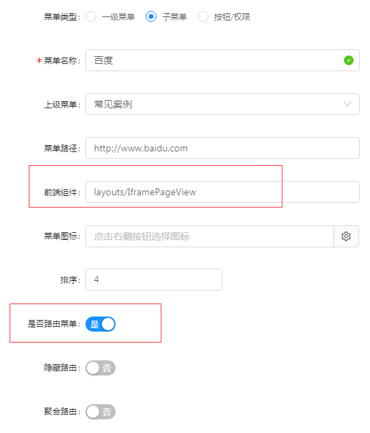
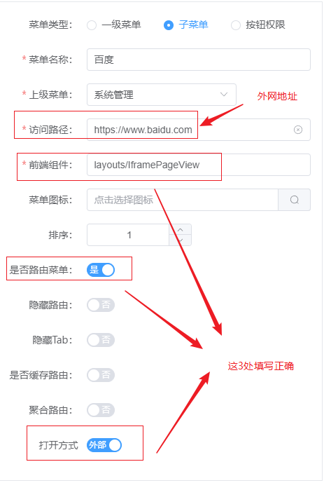

# 菜单配置说明
 

| 字段名称 | 说明                                                         |
| :------- | :----------------------------------------------------------- |
| 菜单类型 | 一级菜单：配置一级菜单；子菜单：配置下级菜单；按钮：配置页面按钮权限 |
| 菜单名称 | 定义菜单名称                                                 |
| 上级菜单 | 菜单类型为子菜单时，选择关联的上级菜单                       |
| 菜单路径 | 定义菜单的路径，通常为：/包名/文件名 具体参见【菜单路径配置说明】 |
| 前端组件 | 定义菜单访问的组件名称，有两种类型，一种为通用组件，一种为具体的页面， |
|          | 具体参见【前端组件配置说明】                                 |
| 菜单图标 | 菜单树展示的图标                                             |
| 排序     | 菜单展示的先后顺序                                           |
| 是否路由 | 此处很重要，默认是路由；如果是非的话，访问404                |
| 隐藏路由 | 不展示为菜单，但是在页面中跳转，弹出的页面路由菜单           |
| 聚合路由 | 多个下级菜单路由在一个页面聚合展示                           |
| 打开方式 | 内部/外部，外部只非路由请求                                  |

### 前端组件配置说明

- 1、非叶子菜单（即没有下级的菜单）配置固定 前端组件layouts/RouteView
- 2、普通的叶子菜单（即具体的页面） 配置相对于src/views目录的路径
  例如src/views/user/helloworld.vue 这个页面，前端组件为 user/helloworld

 

- 3、需要跳转到第三页面的菜单 前端组件固定为：layouts/IframePageView，比如跳转百度：[https://www.baidu.com](https://www.baidu.com/)

- 4、配置外网打开的链接
  请求地址需要以http开头

### 菜单路径配置说明

- 1、非叶子菜单（即没有下级的菜单），URL配置规则：按照功能模块定义的关键根路径即可，不能重复，需以“/”开头
- 2、普通的叶子菜单（即具体的页面），URL和前端组件配置保持一致即可，需在前端组件值前加“/”
- 3、需要跳转到第三方页面的菜单，菜单路径配置第三方跳转的地址即可，例如http://www.baidu.com 

 

| 配置         | 描述                                                         |
| :----------- | :----------------------------------------------------------- |
| 是否路由菜单 | 是：跳转路由的时候根据配置的前端组件值跳转，否：起作用的是菜单路径 |
| 隐藏路由     | 是：左侧菜单不加载反之加载                                   |
| 缓存路由     | 是：路由只加载一次即created只执行一次                        |
| 聚合路由     | 是：只要配置在该路由下面的子路由全部不会显示在左侧菜单栏     |
| 打开方式     | 内部打开是在窗口tab里打开，外部打开浏览器tab打开             |

