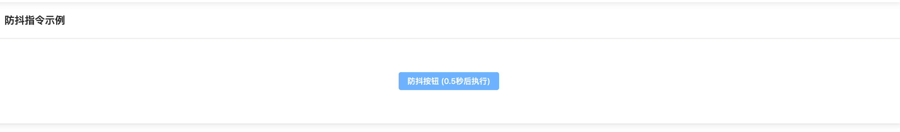

# v-debounce

扩展自定义指令防抖功能



## 基础用法

```typescript
<template>
  <t-card header="防抖指令示例" class="text-lg font-bold">
    <div class="flex items-center justify-center mt-10 mb-10">
      <el-button v-debounce="debounceClick" type="primary">防抖按钮 (0.5秒后执行)</el-button>
    </div>
  </t-card>
</template>

<script setup lang="ts">
  import { ElMessage } from 'element-plus'
  const debounceClick = () => {
    ElMessage.success('防抖按钮触发事件')
  }
</script>

```