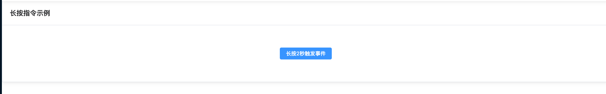

# v-longPress

扩展自定义指令长按指令功能




## 基础用法

```typescript
<template>
  <t-card header="长按指令示例" class="text-lg font-bold">
    <div class="flex items-center justify-center mt-10 mb-10">
      <el-button v-longPress="longpress" type="primary">长按2秒触发事件</el-button>
    </div>
  </t-card>
</template>

<script setup lang="ts">
  import { ElMessage } from 'element-plus'
  const longpress = () => {
    ElMessage.success('长按事件触发成功')
  }
</script>

```