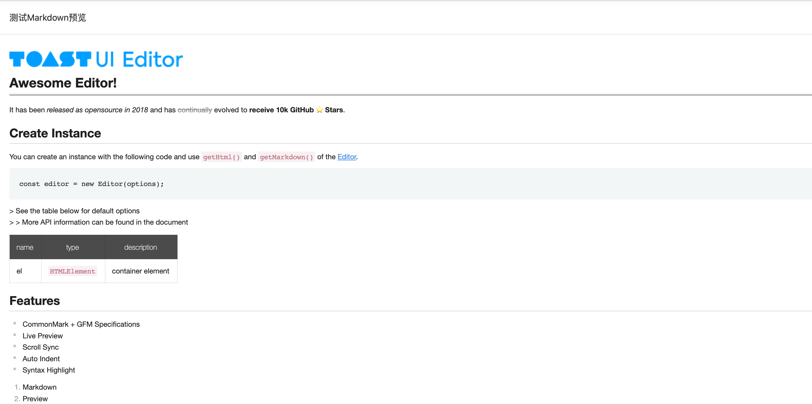

# v-precode

扩展自定义指令富文本渲染功能




## 基础用法

```typescript
<template>
  <div class="p-4">
    <t-card class="mt-5" header="测试Markdown预览">
      <pre v-precode>
      

      # Awesome Editor!

      It has been _released as opensource in 2018_ and has ~~continually~~ evolved to **receive 10k GitHub ⭐️ Stars**.

      ## Create Instance

      You can create an instance with the following code and use `getHtml()` and `getMarkdown()` of the [Editor](https://github.com/nhn/tui.editor).

      ```js
      const editor = new Editor(options);
      ```

      > See the table below for default options
      > > More API information can be found in the document

      | name | type | description |
      | --- | --- | --- |
      | el | `HTMLElement` | container element |

      ## Features

      * CommonMark + GFM Specifications
        * Live Preview
        * Scroll Sync
        * Auto Indent
        * Syntax Highlight
              1. Markdown
              2. Preview

      ## Support Wrappers

      > * Wrappers
      >    1. [x] React
      >    2. [x] Vue
      >    3. [ ] Ember
      </pre>
    </t-card>
  </div>
</template>

```