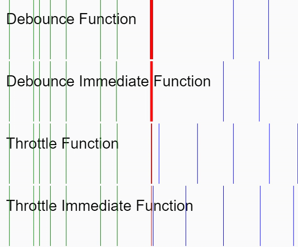

# useRequest

主要作用是在请求的时候，防止用户频繁点击或者误触。

## 核心概念

何谓节流和防抖？



### 节流 (限频)

在事件持续触发的前提下，**保证一定时间段内只调用一次事件处理函数**，就是函数节流。比如我们设定500ms，在这个时间内，无论点击按钮多少次，它都只会触发一次。具体场景可以是抢购时候，由于有无数人 快速点击按钮，如果每次点击都发送请求，就会给服务器造成巨大的压力，但是我们进行节流后，就会大大减少请求的次数。

### 防抖

防抖的意思是，在连续的操作中，无论进行了多长时间，只有某一次的操作后**在指定的时间内没有再操作**，这一次才被判定有效。

具体场景可以搜索框输入关键字过程中实时 请求服务器匹配搜索结果，如果不进行处理，那么就是输入框内容一直变化，导致一直发送请求。如果进行防抖处理，结果就是当我们输入内容完成后，一定时间(比如500ms)没有再 输入内容，这时再触发请求。

结合以上两种情况，回到我们最实际的场景，比如防止表单提交按钮被多次触发，我们应该选择使用节流而不是防抖方案。


## 参数说明

```typescript
export type Service<T, P extends any[]> = (...args: P) => RequestResponse<T>;

export interface Options<T, P extends any[]> {
  // 是否启用 默认false - 不加入防抖节流
  manual?: boolean
  // 默认参数
  defaultParams?: P

  // 防抖时间
  // 设置`debounceWait` 属性，设置防抖时间,在这个时间内，如果再次触发事件，则重新计时，如果在这个时间内没有再次触发事件，则执行事件处理函数。 
  debounceWait?: number

  // leading  防抖部分 决定延迟前后如何触发, true-先调用后等待
  debounceLeading?: boolean
  // trailing 防抖部分 决定延迟前后如何触发, true-先等待后调用
  debounceTrailing?: boolean

  // 节流时间
  // 设置 `throttleWait` 属性，设置节流时间，在这个时间内，只触发一次
  throttleWait?: number
  // 同上 文档：https://www.lodashjs.com/docs/lodash.debounce
  throttleLeading?: boolean
  throttleTrailing?: boolean

  queryKey?: (...args: P) => string
}

export function useRequest<T, P extends any[]>(
  service: Service<T, P>,
  options: Options<T, P> = {}
) {
  // ...

  return {
    run,
    loading,
    queries,
    cancel
  }
}
```


### 请求节流 (throttle)用法

设置 `throttleWait` 属性，设置节流时间，在这个时间内，只触发一次


### 请求防抖 (debounce)用法

设置`debounceWait` 属性，设置防抖时间,在这个时间内，如果再次触发事件，则重新计时，如果在这个时间内没有再次触发事件，则执行事件处理函数。 


### 示例


```html

<template>
  <div>
    <div class="text-red-500"> queryKey示例 </div>
    <ul class="p-[24px]">
      <li v-for="user in userList" :key="user.id">
        <div class="flex justify-between">
          <div>{{ user.username }}</div>
          {{ queries[user.id]?.data }}
          <div>
            <el-button :loading="queries[user.id]?.loading" @click="run(user.id)">请求</el-button>
            <el-button @click="queries[user.id]?.cancel()">取消</el-button>
          </div>
        </div>
      </li>
    </ul>
    <div> queries: {{ queries }} </div>

    <div class="text-red-500">
      debounce: 取消了也会防抖
      <el-button :loading="debounceLoading" @click="debounceRun(1)">请求</el-button>
      <el-button @click="debounceCancel?.()">取消</el-button>
    </div>

    <div class="text-red-500">
      throttle
      <el-button @click="throttleRun(1)">请求</el-button>
      <el-button @click="throttleCancel?.()">取消</el-button>
    </div>
  </div>
</template> 
<script lang="ts"> 
  import { request } from '@/hooks/useRequest/axios'
  import { useRequest } from '@/hooks/useRequest/useRequest'

  interface IUser {
    id: number
    username: string
    email: string
    phone: string
  }

  function getUserInfo(id: number) {
    return request<IUser>({
      url: '/getUserInfo',
      method: 'get',
      params: {
        id
      }
    })
  }

  export default defineComponent({
    setup() {
      const { run, queries } = useRequest<IUser, [number]>(getUserInfo, {
        manual: true,
        queryKey: (id) => String(id)
      })

      const {
        run: debounceRun,
        loading: debounceLoading,
        cancel: debounceCancel
      } = useRequest<IUser, [number]>(getUserInfo, {
        manual: true,
        // 防抖延迟时间1.5s
        debounceWait: 1500,
        defaultParams: [10000]
      })

      const {
        run: throttleRun,
        loading: throttleLoading,
        cancel: throttleCancel
      } = useRequest<IUser, [number]>(getUserInfo, {
        manual: true,
        // 节流请求
        throttleWait: 1500,
        defaultParams: [10000]
      })

      const userList = [
        { id: 10000, username: '张三', email: 'zhangsan@qq.com', phone: 1311111111 },
        { id: 10001, username: '李四', email: 'lisi@qq.com', phone: 1311111111 },
        { id: 10002, username: '王五', email: 'wangwu@qq.com', phone: 1311111111 }
      ]
      return {
        queries,
        run,
        debounceRun,
        debounceLoading,
        debounceCancel,
        throttleRun,
        throttleLoading,
        throttleCancel,
        userList
      }
    }
  })
</script>
```
