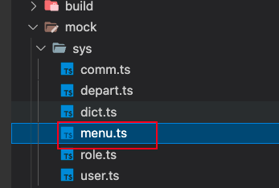

# 介绍

目前菜单相关内容采用mock方式，后续会推出管理后台API，对接起初的菜单权限。

这个篇章主要是接口的设计与页面介绍。


:::tip

菜单必须配合路由进行使用，前端路由 => 动态路由 => 后端数据。

:::


## 菜单类型

接口响应的菜单类型：

```ts
import type { RouteMeta } from 'vue-router'

export interface MenuItem {
  menuType: number //菜单类型: 0一级菜单 1子菜单 2按钮/权限
  name?: string //菜单名称/按钮/权限名称
  url?: string //访问路径
  component: any //前端组件
  redirect?: string //默认跳转地址
  icon?: string //菜单图标
  sortNo?: number //排序
  route?: boolean //是否路由菜单
  hidden?: boolean //隐藏路由
  hideTab?: boolean //隐藏Tab
  keepAlive?: boolean //是否缓存路由
  alwaysShow?: boolean //是否聚合路由
  internalOrExternal?: boolean //打开方式：true：外部路由 false:内部路由
  parentId?: string //上级菜单ID
  perms?: string //授权标识
  permsType?: string // 授权策略 1可见/可访问 2可编辑
  status?: string //状态 1 有效/0 无效

  id: string
  key: string
  createBy?: string
  meta: RouteMeta
  children?: MenuItem[]
}

```


## 新增菜单

直接在 `src/router/modules` 内新增一个模块文件。

不需要手动引入，放在`src/router/modules`内的文件会自动被加载。

可参考[新增路由](/vue3-toimc-admin-doc/guide/guide/router.html#新增路由)部分。


## Mock数据配置

其中mock服务器的配置如下`vite.config.ts`：

```js
viteMockServe({
  ignore: /^\_/,
  mockPath: 'mock',
  supportTs: true,
  prodEnabled: VITE_USE_MOCK,
  // 相当于在src/main.ts中inject下面的代码，所以注意文件的路径问题
  injectCode: `
    import { setupProdMockServer } from '../mock/_createProductionServer';
    setupProdMockServer();
  `
}),
```


菜单相关的mock接口：


